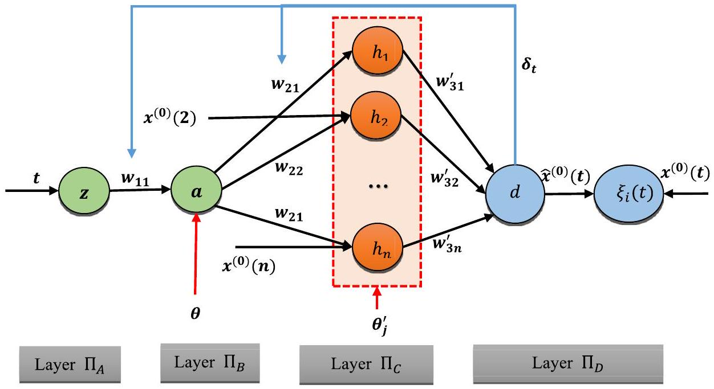
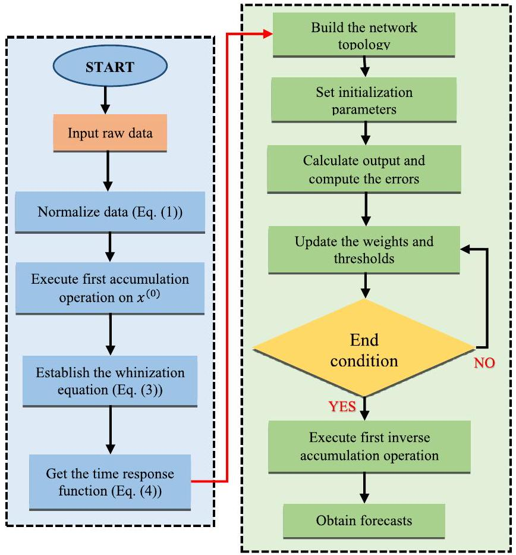
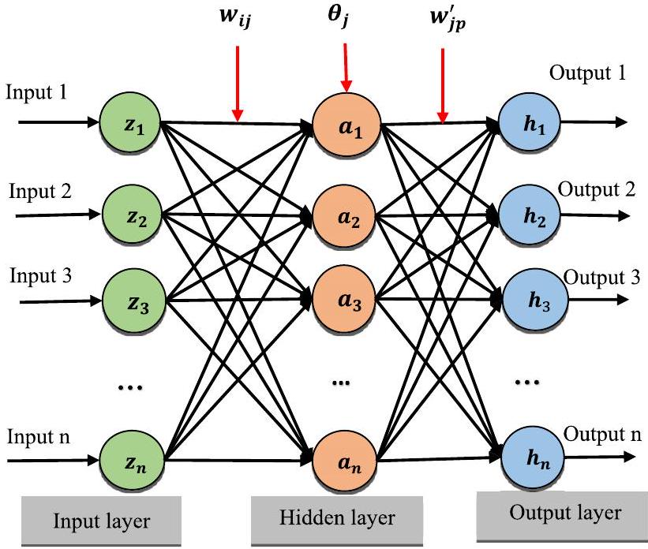
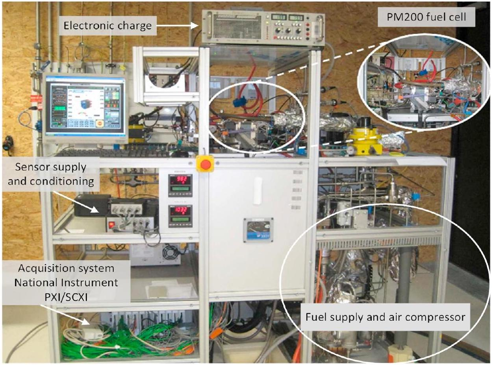
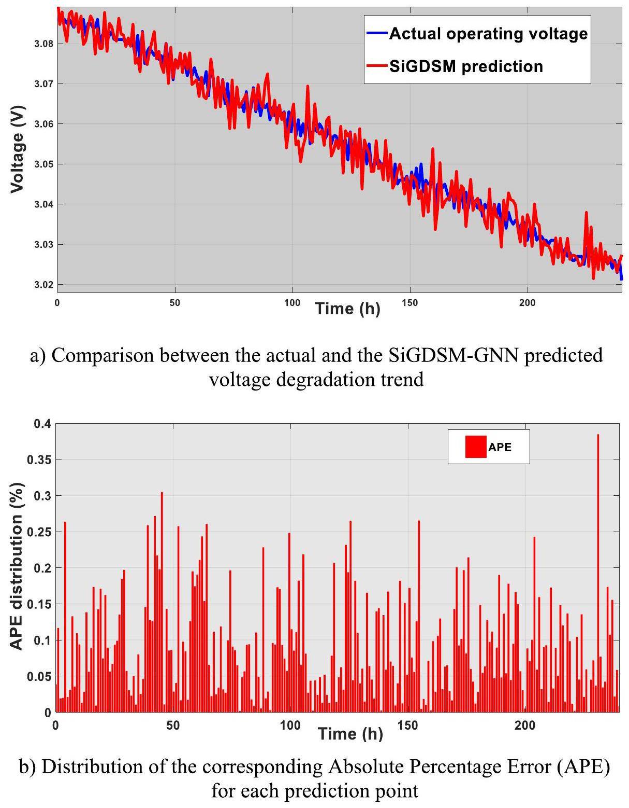
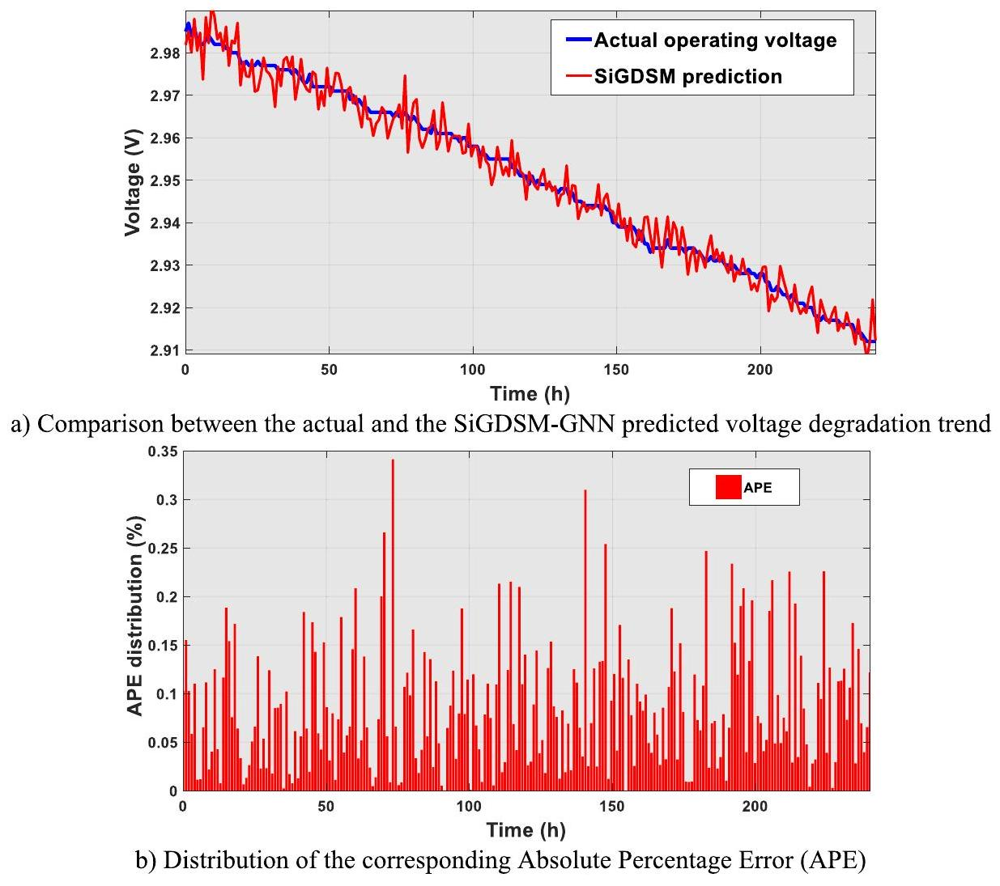
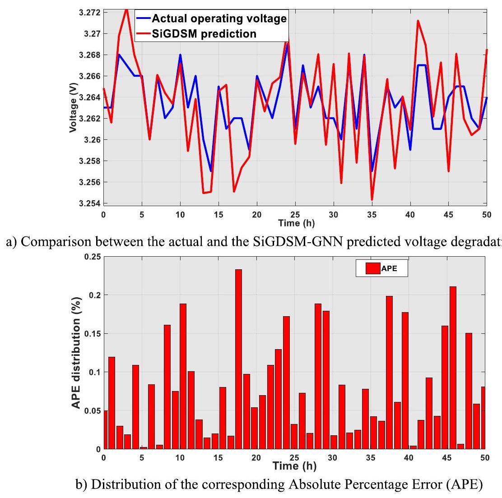
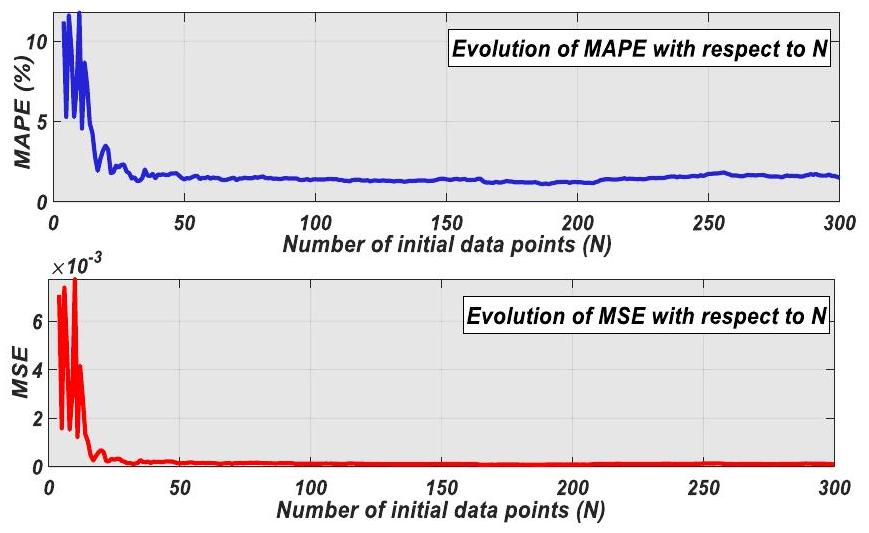

# Real-time degradation prognostics for proton exchange membrane fuel cells using a self-adaptive grey neural network model 

Flavian Emmanuel Sapnken ${ }^{\mathrm{a}, *(B), \text { Yong Wang }{ }^{\mathrm{b}} \text {, Fausto Posso }{ }^{\mathrm{c}} \text {, }}$<br>Ghislain Junior Bangoup Ntegmi ${ }^{\mathrm{d}}$, Reagan Jean Jacques Molu ${ }^{\mathrm{a}}$, Naiming Xie ${ }^{\mathrm{e}}$ (D)<br>${ }^{\mathrm{a}}$ Université de Douala, Institut Universitaire de Technologies, PO Box 8698, Douala, Cameroon<br>${ }^{\mathrm{b}}$ School of Sciences, Southwest Petroleum University, Chengdu, Sichuan, 610500, China<br>${ }^{\mathrm{c}}$ Universidad de Santander, Facultad de Ingenierías y Tecnologías, Instituto de Investigación Xerira, Bucaramanga, Colombia<br>${ }^{\mathrm{d}}$ Université de Yaoundé, 1 Environmental Energy Technologies, PO Box 812, Yaoundé, Cameroon<br>${ }^{\mathrm{e}}$ College of Economics and Management, Nanjing University of Aeronautics and Astronautics, Nanjing, Jiangsu, 210016, China

## H I G H L I G H T S

- A self-intelligent grey neural network for PEMFC degradation prognostics is proposed.
- The model adapts gradient descent strategies dynamically to escape local minima.
- The model is validated on steady state, high-frequency ripple, and FCEV datasets.
- Simulations achieve $0.11 \%$ MAPE in 0.005 s under dynamic operating conditions.
- The model outperforms most competing algorithms in accuracy and computational speed.


## A R T I C L E I N F O

## Keywords:

Neural grey model
Particle swarm optimization
Self-intelligent mechanism
PEMFC degradation prediction


#### Abstract

Accurate prediction of performance degradation in proton exchange membrane fuel cells (PEMFCs) is essential for predictive maintenance and commercial viability. This task is challenged by data scarcity, complex operational noise, and highly dynamic conditions. Current data-driven models often require large datasets and lack adaptive optimization, compromising accuracy or efficiency. To overcome this, we propose a novel selfintelligent gradient descent search mechanism-driven grey neural network (SiGDSM-GNN). The model integrates grey system theory, adept at handling uncertain, limited data, with the nonlinear learning power of neural networks. Its key innovation is a self-intelligent mechanism that dynamically selects and adapts gradient descent strategies during training, significantly enhancing convergence and robustness. Extensive testing on three realistic PEMFC datasets-steady-state, dynamic loading with 5 kHz current ripples, and real-world vehicle operation-demonstrated superior performance. SiGDSM-GNN achieved a mean absolute percentage error of $0.11 \%$, a noise-to-signal ratio of 0.005 , and a prediction time of 0.005 s , outperforming benchmark models including optimization algorithms and deep learning hybrids. This work provides a highly accurate, dataefficient, and real-time capable framework for PEMFC degradation forecasting, advancing predictive maintenance strategies for cleaner energy systems.


## 1. Introduction

### 1.1. Background and motivations

The transition to renewable energy systems has positioned proton exchange membrane fuel cell (PEMFCs) as an essential technological
component [1,2]. As electrochemical devices that convert oxygen and hydrogen into electricity (in addition of water and heat, as by-products), PEMFCs offer high energy efficiency, quiet operation, and zero emissions, making them particularly attractive for applications in transportation, stationary power generation, and portable energy solutions [3,4]. Their ability to operate at moderate temperatures and provide

[^0]rapid start-up times further enhances their potential for integration into clean energy infrastructures, such as hydrogen-powered vehicles and backup power systems [5].

Despite these advantages, the widespread adoption of PEMFCs is constrained by their limited operational lifespan, primarily due to performance degradation over time [6,7]. Accurately predicting this degradation is essential for optimizing maintenance strategies, extending fuel cell lifespan, and improving overall cost-effectiveness. In automotive applications, for example, the typical PEMFC lifespan is around 3000 h , whereas commercial viability requires at least 5000 h of reliable operation [8,9]. A precise and efficient degradation prediction model can facilitate proactive maintenance, reduce operational downtime, and enhance the long-term economic feasibility of PEMFC technology.

Beyond simple lifetime estimation, accurate PEMFC degradation prediction plays a crucial role in operational optimization and health management. Reliable prognostic models enable predictive maintenance scheduling, early fault detection, adaptive load management, and optimized thermal and water-management strategies, thereby reducing unexpected downtime and minimizing operational costs. In automotive and stationary power applications, degradation-aware operational control can help prevent excessive stress conditions, improve system reliability, and extend the effective service life of fuel cell stacks. Furthermore, accurate real-time prognostics support decision-making processes related to energy management, maintenance planning, and component replacement scheduling, all of which are essential for the commercial deployment and long-term economic viability of PEMFC technologies.

During long-term PEMFC operation, performance degradation progressively occurs due to a combination of complex electrochemical, mechanical, and operational phenomena [10]. These include catalyst dissolution and agglomeration, carbon support corrosion, membrane thinning, electrode material degradation, hydration/dehydration cycling, gas starvation, and fluctuations in operating temperature, humidity, and load current. Such degradation processes contribute to voltage decay, efficiency reduction, power loss, shortened operational lifespan, and increased maintenance costs. In addition, PEMFCs may exhibit reversible voltage recovery phenomena during operation, which can complicate degradation forecasting because predictive models may inadvertently learn mixed recovery-degradation trends rather than the underlying long-term degradation evolution.

However, modelling PEMFC degradation presents significant challenges due to the complex, non-linear, and uncertain nature of degradation mechanisms [11,12]. PEMFCs comprise multiple interacting components (such as membrane, electrode, catalyst, gas diffusion layer, and the bipolar plate) each of which deteriorates under varying operational conditions [13]. Factors such as inadequate water and thermal management, gas starvation, and fluctuating load currents contribute to degradation in ways that are difficult to quantify using conventional models, despite water being a by-product in the operation of PEMFCs [14,15]. Additionally, the scarcity of long-term operational data further complicates the development of accurate predictive models. Addressing these challenges requires an advanced predictive approach capable of learning degradation patterns and operational dependencies from limited and uncertain data.

By combining grey system theory (GST) and neural network principles, this study proposes a novel self-intelligent gradient descent search mechanism-driven grey neural model (SiGDSM-GNN) to enhance PEMFC degradation prediction. This approach aims to provide more reliable forecasts using minimal historical data, ultimately supporting the sustainable deployment of fuel cell technology in real-world applications.

The primary motivation for this study is the urgent need for accurate and reliable degradation forecasting models for PEMFCs. Given the complex interactions between multi-physical, multi-phase, and multiscale degradation mechanisms, traditional physics-based models often require extensive computational resources and detailed material
properties, which may not always be available. Furthermore, datadriven approaches, particularly machine learning (ML) models, typically demand large datasets for effective training, which can be a challenge in real-world PEMFC applications where historical data are limited.

### 1.2. Current approaches and limitation

Various methods have been explored for PEMFC degradation prediction, which can be broadly categorized into data-centric approaches [16-18], models grounded in physical principles [19,20], and combined methodologies [21-23]. Physics-derived models rely on detailed electrochemical and mechanical principles to simulate degradation processes, such as catalyst dissolution [11,12], membrane thinning [24,25], and carbon corrosion [26,27]. These modeling approaches offer critical understanding of the underlying processes governing PEMFC deterioration over time. However, their complexity, reliance on extensive material properties, and high computational costs limit their practical application, particularly in real-time monitoring and predictive maintenance scenarios, which is further worsened by the need for reliable values of operational parameters and coefficients in the equations representing the transport phenomena of mass, energy, and momentum that model their operation [28].

In recent studies, data-centric modeling paradigms employing advanced machine learning algorithms-particularly ANNs [29,30], SVM architectures [22,31] and recurrent neural networks (RNNs) [6, 32]-have become progressively prevalent. These models have demonstrated strong predictive capabilities by capturing complex, nonlinear dependencies between input variables and fuel cell performance indicators. However, their effectiveness is heavily dependent on the availability of large, high-quality datasets, which are often difficult to obtain in PEMFC applications [33]. Additionally, data-driven models struggle with extrapolation beyond their training data, limiting their generalization to new operating conditions.

Hybrid models, which unify theoretical physics foundations with artificial intelligence techniques, seek to balance model interpretability and prediction accuracy. By incorporating physical constraints into ML frameworks, hybrid models like those reported in Refs. [6,16,22] can improve robustness and reduce dependence on large datasets. However, their implementation often requires significant parameter tuning, which can be computationally expensive and challenging for real-world deployment.

One emerging alternative is GST, which is particularly well-suited for applications where available datasets are limited or exhibit significant uncertainty. The GST methodology has demonstrated effective implementation across multiple engineering domains, including energy forecasting [34-37], fault detection [38,39], and reliability assessment [40-42]. These models require fewer data points compared to traditional ML techniques, making them attractive for PEMFC degradation prediction where long-term operational data may be limited [5]. Despite these advantages, grey-based approaches in PEMFC degradation modelling remain underexplored, and existing implementations often lack adaptability to dynamic operating conditions.

The work of Tang et al. [43] further demonstrates that multi-source data coupling may alleviate some limitations associated with sparse operational datasets by enriching degradation feature extraction. This perspective aligns conceptually with the present study's integration of grey-system theory and neural learning mechanisms, suggesting that future extensions of the proposed framework could incorporate multimodal electrochemical information such as EIS measurements, polarization-curve indicators, or physics-informed health descriptors to further improve degradation interpretability and prognostic robustness.

In light of existing approaches' limitations, there is an urgent requirement for prediction methods that demonstrate greater adaptability and data efficiency for PEMFC degradation. Addressing the challenges of data scarcity, lack of adaptability, and optimization
inefficiencies requires a model that can effectively learn from limited and uncertain data while dynamically adjusting to evolving operational conditions [44]. To this end, the SiGDSM-GNN emerges as a promising solution. By combining GST to handle limited data and integrating neural networks for adaptive learning, such a model would improve prediction accuracy and generalization capabilities. Additionally, incorporating optimization techniques within a dynamic learning framework would enhance computational efficiency and ensure more reliable degradation forecasting, ultimately contributing to the extended lifespan and optimized maintenance of PEMFCs.

### 1.3. Identification of research gaps

Despite significant advancements in PEMFC degradation prediction, several critical research gaps persist, limiting the effectiveness and practical implementation of existing models. Addressing these gaps is essential for developing more reliable and adaptive predictive frameworks capable of enhancing PEMFC lifespan and performance in realworld applications.

First, data scarcity remains a major challenge in PEMFC degradation modelling. Many data-driven approaches, including deep neural networks, demonstrate strong dependence on extensive datasets of pristine quality to accurately characterize deterioration patterns [6,17]. However, in real-world applications, long-term operational data are often limited due to the high costs, time-consuming nature, and logistical constraints of extensive fuel cell testing [45,46]. This scarcity not only restricts model accuracy but also reduces generalizability across different operating conditions. As a result, the field urgently requires prognostic models that can deliver reliable predictions despite constrained datasets.

Second, existing models lack adaptability to dynamic operational conditions [47]. PEMFCs operate in environments where load currents, temperature, and humidity fluctuate continuously. Many conventional degradation models are static [48,49], meaning they struggle to update or recalibrate when new operational data become available. This limitation reduces their long-term reliability and restricts their application in practical scenarios, such as automotive and stationary power systems, where real-time adjustments are crucial for maintaining optimal performance. A truly effective degradation prediction model should incorporate adaptive learning mechanisms to continuously refine its predictions as new data emerges.

Third, optimization constraints hinder the efficiency and accuracy of current models. Many ML-based approaches employ traditional optimization algorithms, which may suffer from slow convergence rates, susceptibility to local minima, or poor generalization to unseen data [50, 51]. These limitations make it difficult to develop models that are both computationally efficient and highly accurate. An improved predictive framework should integrate advanced optimization techniques to enhance training efficiency, prevent overfitting, and ensure robust generalization across diverse operating conditions.

### 1.4. Objectives, contributions and innovation

The primary objective of this study is to develop a robust and adaptive degradation prediction model for PEMFCs that can operate effectively with limited data, high uncertainty, and dynamic operational conditions. To achieve this, the study introduces the SiGDSM-GNN model, which combines the strengths of GST, adaptive learning, and advanced optimization techniques. This innovative approach aims to enhance prediction accuracy, computational efficiency, and real-time adaptability, thereby addressing key limitations in existing PEMFC degradation models. The principal innovations and original contributions of this work include.
i. Introduction of a grey neural model for PEMFC degradation prediction, which integrates GST to handle limited and uncertain
data. Unlike conventional data-driven models that require extensive training datasets, the proposed approach effectively extracts meaningful degradation patterns from limited historical data, making it particularly suitable for real-world PEMFC applications with restricted long-term measurements.
ii. Development of a self-intelligent gradient descent search mechanism to optimize the learning process and improve the model's convergence efficiency. This mechanism dynamically adjusts learning parameters to prevent slow convergence, avoid local minima, and enhance prediction stability, leading to a more efficient and accurate degradation forecasting framework.
iii. The proposed approach combines grey neural modelling with an adaptive learning framework that can be extended to incorporate newly available operational data. Unlike static degradation models, this structure provides the potential for improved adaptability under varying operating conditions. However, dynamic updating is not explicitly implemented in the present study and remains a promising direction for future research, particularly for real-time deployment in PEMFC systems.
iv. Consideration of critical operational parameters, including relative humidity, hydrogen pressure, inlet temperature, and load current, to develop a comprehensive degradation prediction model. These parameters are important for learning observable degradation behaviors and improving predictive reliability under varying operating conditions, enabling improved prediction of PEMFC degradation evolution and supporting maintenanceoriented decision making.

By addressing existing challenges in PEMFC degradation modelling, this study aims to provide a more reliable, efficient, and adaptable predictive framework. The proposed model not only improves degradation forecasting accuracy but also contributes to optimized maintenance strategies, reduced operational costs, and enhanced durability of PEMFCs, making it particularly valuable for hydrogen fuel cell electric vehicles (FCEVs) and stationary power applications.

Overall, the core innovation of this study lies in the integration of grey system theory with a self-intelligent gradient descent mechanism, enabling accurate, robust, and computationally efficient degradation prediction under data-scarce and dynamic operating conditions.

### 1.5. Organisation of the study

To systematically address the challenges identified in PEMFC degradation prediction and achieve the study's objectives, the following outline describes the structure of this paper.
i. Section 2 presents the methodology, detailing the development of the grey neural network (GNN) and the SiGDSM model. This section explains how the integration of GST with neural networks enables accurate degradation prediction despite data limitations. Additionally, it describes how the proposed optimization mechanism enhances learning efficiency and ensures adaptive model performance under varying operational conditions.
ii. Section 3 outlines the experimental setup and validation procedures, which are designed to rigorously assess the proposed model's effectiveness. It details the datasets used, the selection of key operational parameters, and the performance evaluation criteria. The validation process ensures that the model is not only theoretically sound but also applicable in real-world PEMFC degradation forecasting.
iii. Section 4 presents a comprehensive discussion of the results, including a comparative analysis with existing degradation prediction models. This analysis highlights the advantages of the proposed approach in terms of predictive accuracy, adaptability, and computational efficiency. The discussion further
contextualizes these findings, demonstrating how the model improves upon conventional methods.
iv. Section 5 concludes the study by summarizing key findings and their implications. It also outlines potential future research directions, emphasizing how further refinements in grey neural modelling and optimization strategies could enhance PEMFC lifespan prediction and maintenance planning.

## 2. Methodology

This section presents the proposed self-adaptive GNN framework for real-time degradation prognostics of PEMFCs. The model integrates grey system theory with neural network principles to address data scarcity and uncertainty, while a novel self-intelligent gradient descent search mechanism enhances learning efficiency and predictive accuracy.

### 2.1. Grey system modelling foundations

GST is well-suited for modeling systems characterized by limited data and uncertainty, as it can extract meaningful information from small sample sequences through accumulated generating operations (AGO) and grey differential equations.

Let $x^{(0)}=\left(x^{(0)}(1), x^{(0)}(2), \ldots, x^{(0)}(n)\right)$ denote the original sequence of historical PEMFC operational data. A minimum of four data points is required to construct the GNN model [52]. The input variables include PEMFC voltage (at previous time steps), ${ }^{1}$ relative humidity, hydrogen pressure, temperature, and inlet current. Note that voltage serves as an input in the form of historical observations, while the model predicts its future degradation behavior.

Since the input variables have different units and scales, they are first normalized to the interval [0,1] using Eq. (1):
$x_{i^{\prime}}=\frac{x_{i}-x_{i, \text { min }}}{x_{i, \text { max }}-x_{i, \text { min }}}$,
where $x_{i}$ is the original value, and $x_{i, \text { min }}$ and $x_{i, \text { max }}$ are the minimum and maximum values in the dataset, respectively.

To reduce randomness and improve smoothness, the first-order accumulated generating operation (1-AGO) is applied to the original sequence:
$x^{(1)}(k)=\sum_{i=1}^{k} x^{(0)}(i), k=1,2, \ldots, n$.

The resulting 1-AGO sequence $\boldsymbol{x}^{(1)}$ in Eq. (2) approximately follows an exponential growth pattern and can be described by the first-order whitening differential equation with multiple inputs and a single output [21,53]:
$\frac{d x^{(1)}}{d t}+a x^{(1)}=b_{1} u_{1}+b_{2} u_{2}+b_{3} u_{3}+b_{4} u_{4}+b_{5} u_{5}$,

In Eq. (3), $a$ and $b_{i}(i=1, \ldots, 5)$ are the model coefficients to be identified, and $u_{i}$ represent the normalized input variables.

The analytical solution (time response function) of Eq. (3) is given by Eq. (4):
$\widehat{x}^{(1)}(k+1)=\left(x^{(0)}(1)-\frac{1}{a} \sum_{i=1}^{5} b_{i} u_{i}\right) e^{-a k}+\frac{1}{a} \sum_{i=1}^{5} b_{i} u_{i}$.

This solution can be reformulated in a form suitable for integration with a neural network as in Eq. (5):

[^1]$\widehat{x}^{(1)}(k+1)=\beta_{1} e^{-a k}+\beta_{2}$,
where $\beta_{1}$ and $\beta_{2}$ are parameters derived from the grey model coefficients.

The grey model is then embedded into a back-propagation neural network (BPNN) to form the standard GNN. The network consists of four layers (denoted $\Pi_{A}, \Pi_{B}, \Pi_{C}, \Pi_{D}$ ), as shown in Fig. 1. The relationship between the grey model coefficients ( $a, b_{i}$ ) and the network weights/ thresholds is established through the following transformations [54], as in Eq. (6):
$a=-w_{11}, b_{i}=\frac{w_{1, i+1}}{w_{11}}(i=1, \ldots, 5)$,
with the output layer threshold given accordingly.
A sigmoid activation function in Eq. (7) is employed in the hidden layer to capture system nonlinearity:
$f(x)=\frac{1}{1+e^{-x}}$,
while linear activation functions are used in the remaining layers to accurately predict continuous physical variables such as PEMFC voltage degradation, which is consistent with standard neural network regression practices and the linear structure of the grey model formulation.

Training of the GNN is performed using the standard backpropagation algorithm. For each training sample, layer outputs are calculated, prediction errors are determined, and network weights and thresholds are updated iteratively via gradient descent until convergence is achieved. Once training is complete, the parameters are substituted into the time response function (Eq. (4)), and the inverse accumulated generating operation (IAGO) is applied to restore the predicted values to the original scale given by Eq. (8):
$\widehat{x}^{(0)}(k)=\widehat{x}^{(1)}(k)-\widehat{x}^{(1)}(k-1)$.

The overall training and prediction process of the standard GNN model is illustrated in the flowchart in Fig. 2. Within the proposed SiGDSM-GNN framework, the grey-system component and neuralnetwork component play complementary but functionally distinct roles. The grey accumulated generating operation (1-AGO) acts primarily as a prior trend extraction and uncertainty-reduction mechanism by transforming sparse and noisy degradation measurements into smoother monotonic sequences that better reflect the dominant degradation evolution trend. This pre-processing stage reduces stochastic variability and improves the suitability of limited operational data for subsequent learning. The neural-network component then operates as an adaptive nonlinear residual-learning mechanism, capturing complex dynamic relationships and local deviations that cannot be fully represented through grey-system modelling alone. Consequently, the overall framework combines the robustness of grey-system pre-processing under sparse-data conditions with the nonlinear approximation capability of neural learning. The proposed framework should therefore not be interpreted as a simple direct coupling between GST and neural learning, but rather as a hierarchical trend-extraction and adaptivecorrection architecture.

### 2.2. Neural network formulation

While the standard GNN effectively combines grey system theory with neural network principles, it remains susceptible to entrapment in local optima due to random initialization of weights and thresholds [55]. To overcome this limitation and improve convergence speed and prediction accuracy, SiGDSM is incorporated. This mechanism dynamically adapts the optimization process, enhances global search capability, and reduces the risk of premature convergence [56].

The GNN is structured as a fully connected feed-forward network with an input layer, one hidden layer, and an output layer, as illustrated


Fig. 1. Topological architecture of a standard GNN prediction model with back-propagation mechanism, showing the interconnected layers ( $\Pi_{\mathrm{A}}, \Pi_{\mathrm{B}}, \Pi_{\mathrm{C}}, \Pi_{\mathrm{D}}$ ), data flow, and key variables ( $x^{(0)}(i), w_{i j}, \xi_{i}$ ).


Fig. 2. Flowchart depicting the training and prediction process of the standard GNN model, outlining the sequence from parameter initialization to final inverse accumulated generating operation (IAGO).

in Fig. 3. The network parameters (connection weights and thresholds) are optimized using back-propagation, where training consists of forward propagation to compute outputs and errors, followed by backward propagation to update parameters [57].

### 2.2.1. Forward propagation

Let $x_{j}$ denote the value of the $j$-th node in the input layer. For the hidden layer, the output of the $i$-th hidden neuron is calculated using Eq. (9):

$$
\begin{equation*}
h_{i}=f\left(\sum_{j} w_{i j} x_{j}+\theta_{i}\right), \tag{9}
\end{equation*}
$$


Fig. 3. Coding strategy for a fully connected neural network, illustrating the vector-based encoding of connection weights ( $w, w^{\prime}$ ) and node thresholds ( $\theta, \theta^{\prime}$ ) into a single parameter vector $p(j)$ for population-based optimization.

where $w_{i j}$ is the synaptic weight connecting the $j$-th input to the $i$-th hidden neuron, $\theta_{i}$ is the bias (threshold) of the hidden neuron, and $f(\cdot)$ is the activation function. For the output layer, the predicted value $\widehat{y}_{k}$ is given by Eq. (10):

$$
\begin{equation*}
\widehat{y}_{k}=g\left(\sum_{i} v_{i k} h_{i}+\gamma_{k}\right), \tag{10}
\end{equation*}
$$

where $v_{i k}$ is the weight connecting the $i$-th hidden neuron to the $k$-th output neuron, $\gamma_{k}$ is the output bias, and $g(\cdot)$ denotes the output activation function (linear in this case). Model performance is evaluated using the Mean Squared Error (MSE) as the fitness function:

$$
\begin{equation*}
\operatorname{MSE}=\frac{1}{N} \sum_{i=1}^{N}\left(y_{i}-\widehat{y}_{i}\right)^{2}, \tag{11}
\end{equation*}
$$

In Eq. (11), $y_{i}$ and $\widehat{y}_{i}$ are the target and predicted values, respectively, and $N$ is the number of samples. Lower MSE values indicate better
agreement between predicted and actual degradation behavior.

### 2.2.2. Backward propagation and parameter update

Parameter updates follow the gradient descent principle. The general rules for updating weights and thresholds are describe by Eqs (12) and (13):

$$
\begin{equation*}
w \leftarrow w-\eta \frac{\partial E}{\partial w}, \tag{12}
\end{equation*}
$$

$$
\begin{equation*}
\theta \leftarrow \theta-\eta \frac{\partial E}{\partial \theta}, \tag{13}
\end{equation*}
$$

where $\eta$ is the learning rate and $E$ is the error (MSE).
For the output layer, the error gradient is derived using the chain rule [58]. With a sigmoid activation function in the hidden layer, whose derivative is given by Eq. (14):

$$
\begin{equation*}
f^{\prime}(x)=f(x)(1-f(x)), \tag{14}
\end{equation*}
$$

the gradients for weights and thresholds between the hidden and output layers are computed using Eqs. (15) and (16):

$$
\begin{equation*}
\Delta v_{i k}=-\eta \delta_{k} h_{i} \tag{15}
\end{equation*}
$$

$$
\begin{equation*}
\Delta \gamma_{k}=-\eta \delta_{k}, \tag{16}
\end{equation*}
$$

where $\delta_{k}$ represents the error term of the output neuron. Similar gradient calculations are performed for the weights and thresholds between the input and hidden layers. These updates are applied iteratively to minimize the MSE.

### 2.2.3. Gradient descent optimization strategy

Conventional gradient descent variants (batch, stochastic, and minibatch) frequently encounter challenges with local optima in complex forecasting tasks. To address this, the proposed SiGDSM adopts a population-based approach. A population of candidate solutions is initialized, where each individual encodes all network weights and thresholds as a single vector (vector encoding strategy shown in Fig. 3). Multiple gradient descent strategies with different learning rates are employed as solution generation heuristics. At each iteration, new candidates are generated, evaluated using the MSE fitness function, and retained if they improve the current best solution. This mechanism provides stronger global search capability and forms the foundation for the self-intelligent adaptation introduced in the next subsection.

### 2.3. The self-intelligent gradient descent mechanism

To further enhance global search capability and avoid premature convergence to local optima, a self-intelligent gradient descent search mechanism (SiGDSM) is proposed. SiGDSM treats multiple gradient descent variants with different learning rates as solution generation heuristics (SSEHs) and stores them in a dynamic strategy pool. A selfintelligent adaptation layer intelligently adjusts the selection probability of each heuristic based on its real-time performance during the optimization process.

The mechanism operates as follows. At the beginning of training, a population of candidate parameter vectors is randomly initialized. Each individual in the population encodes all network weights and thresholds into a single vector using the vector encoding strategy. In each generation, an SSEH is selected from the strategy pool using a roulette-wheel selection based on its current probability. The selected heuristic generates new candidate solutions, which are then evaluated using MSE as the fitness function.

The performance of each SSEH is continuously monitored and recorded through two indicator matrices that track successful and unsuccessful improvements to the current best individual in the population. After a predefined number of generations, the success and failure
counts for each strategy are aggregated. The selection probability of the $j$-th heuristic is then updated according to its historical performance using the following rules:

$$
\begin{equation*}
p_{j}(k+1)=\frac{S_{j}(k)+\varepsilon}{\sum_{i=1}^{M}\left(S_{i}(k)+\varepsilon\right)}, \tag{17}
\end{equation*}
$$

In Eq. (17), $S_{j}(k)$ is the number of successful improvements achieved by the $j$-th strategy up to generation $k, M$ is the total number of SSEHs in the pool, and $\varepsilon=0.0001$ is a small positive constant introduced to ensure all strategies maintain a non-zero selection probability.

The updated probabilities are normalized to sum to one. This adaptive probability adjustment enables the mechanism to dynamically favor the most effective gradient descent strategies at different stages of the search process, thereby improving robustness, convergence speed, and the likelihood of reaching the global optimum. The detailed implementation of the SiGDSM, including the complete pseudo-code, is provided in Appendix A.

By integrating this self-intelligent mechanism, the optimization process becomes adaptive and responsive to the evolving characteristics of the PEMFC degradation data, significantly enhancing the overall predictive performance of the GNN model.

Detailed mathematical derivations of the back-propagation parameter updates, the vector encoding strategy, and the full probability adaptation rules of the SiGDSM are provided in Appendix B.

The current self-intelligent gradient descent search mechanism employs a bounded discrete learning-rate strategy pool to ensure numerical stability and convergence robustness under sparse-data conditions. Although this design reduces the risk of unstable parameter oscillations and overfitting, it may limit exploration capability compared with continuous adaptive optimization strategies. Future extensions of the proposed framework could therefore investigate continuous strategyspace optimization approaches, including dynamically self-regulated learning-rate scheduling, reinforcement-learning-guided adaptation, or hybrid metaheuristic-gradient optimization mechanisms. Such approaches may further improve global search flexibility and convergence efficiency under highly dynamic PEMFC operating conditions. The adopted discrete strategy pool should therefore be interpreted as a stability-oriented design choice rather than a theoretical limitation of the proposed framework.

### 2.4. Integrated SiGDSM-GNN framework

The proposed model integrates the grey system modeling foundations, neural network formulation, and self-intelligent gradient descent search mechanism into a unified self-adaptive grey neural network (SiGDSM-GNN) framework for real-time degradation prognostics of proton exchange membrane fuel cells (PEMFCs).

In this integrated framework, historical PEMFC operating data, including voltage (at previous time steps), relative humidity, hydrogen pressure, temperature, and inlet current, are first normalized to the interval $[0,1]$. The normalized data undergo first-order accumulated generating operation (1-AGO) to reduce randomness. The resulting sequence is then processed through the GNN architecture, where the whitening differential equation is embedded into the multi-layer network structure.

Network weights and thresholds are optimized using the SiGDSM. This mechanism employs a population of candidate solutions encoded as vectors and dynamically adjusts the selection probabilities of multiple gradient descent heuristics based on their performance. Once training converges, the optimized parameters are substituted into the grey time response function. The inverse accumulated generating operation (IAGO) is finally applied to restore the predictions to the original data scale.

The complete SiGDSM-GNN framework operates in a rolling time-
window mode, continuously incorporating new operational data to update the model parameters in real time. This design enables the model to adapt effectively to varying operating conditions and evolving datadriven degradation trends.

By combining the strengths of grey system theory for small-sample modeling, neural networks for nonlinear mapping, and SiGDSM for adaptive optimization, the integrated framework achieves high prediction accuracy, strong robustness to uncertainty and noise, and improved convergence performance, making it suitable for practical PEMFC prognostics and health management applications.

It should be noted that the proposed SiGDSM-GNN framework is a data-driven prognostic model intended to learn degradation evolution patterns from operational data rather than explicitly model the underlying electrochemical degradation mechanisms of PEMFCs.

## 3. Experimental setup

To ensure a thorough evaluation of the proposed method, three distinct degradation experiments were conducted on PEMFCs under diverse operating environments. The research employs a tripartite experimental design: (i) steady-state degradation analysis under constant current load, (ii) dynamic stress testing with high-frequency current fluctuations, and (iii) real-world validation through FCEV operational monitoring. This comprehensive approach captures degradation mechanisms across operational paradigms from controlled laboratory conditions to actual vehicular environments, and thus enables a robust assessment of the proposed method across different real-world scenarios.

### 3.1. Data description and experimental protocol

The empirical datasets were acquired through rigorous testing on a 1.0 kW PEMFC test station (FCLAB-H2 platform) at FEMTO-ST Institute's fuel cell laboratory (University of Bourgogne Franche-Comté, France), utilizing standardized protocols for performance characterization [45]. The experimental setup employed PXIe-4300 high-precision data acquisition cards integrated with customized LabVIEW virtual instrumentation, which recorded electric, fluidic, and thermal parameters at a frequency of 1.0 Hz . Electrochemical impedance spectra (EIS) were also collected using an in-lab impedance meter, covering a frequency range of 50.0 mHz to 10.0 kHz .

Two $1000-\mathrm{h}$ tests were conducted on 1.0 kW PEMFCs - one under constant $0.70 \mathrm{~A} / \mathrm{cm}^{2}$ load, and another with 5.0 kHz triangular current variations ( $10 \%$ of nominal current density).

Data collection for Fuel Cell 1 (without ripples) followed a specific protocol. An initial EIS was recorded before polarization at the nominal current density, followed by a polarization curve from 0 to $1.0 \mathrm{~A} / \mathrm{cm}^{2}$ over 1000 s . EIS measurements were then taken after polarization at 0.7 , 0.45 , and $0.20 \mathrm{~A} / \mathrm{cm}^{2}$. Characterization tests were conducted at 0,48 , $185,348,515,658,823$, and 991 h . For Fuel Cell 2 (with ripples), the protocol included a polarization curve from 0 to $1.0 \mathrm{~A} / \mathrm{cm}^{2}$ over 1000 s , followed by EIS measurements after polarization at $0.7,0.45$, and 0.20 A/ $\mathrm{cm}^{2}$. Characterization tests were performed at $0,35,182,343,515$, 666, 830, and 1016 h .

The datasets are limited due to the infrequent characterization tests, with intervals ranging from 35 to 185 h . This scarcity poses challenges for continuous degradation monitoring, as it limits the availability of high-resolution temporal data. Additionally, the raw nature of the data requires pre-processing to remove noise and outliers, ensuring reliable analysis. The datasets are publicly accessible through the IEEE PHM Data Challenge repository [59]. It should be noted that the preprocessing step is limited to basic data cleaning procedures, including the removal of outliers and inconsistent measurements, and does not involve aggressive denoising techniques; thus, the dataset retains inherent measurement noise representative of real PEMFC operating conditions.

To facilitate model training and validation, the complete dataset was partitioned using a 70-30 ratio, with the majority allocated for model training and the remainder reserved for validation purposes, ensuring a balanced approach for performance evaluation [34,35]. The training set was used to fine-tune model parameters, while the test set provided an independent assessment of predictive accuracy. The methodology employed 30 repeated executions of each algorithm on every dataset, using mean values for comparative assessment to enhance result reliability. This approach mitigates the effects of random initialization and ensures consistency in performance evaluation, enabling a comprehensive assessment of the method's ability to predict PEMFC degradation across varying conditions.

For clarity, the number of available data points in each case study is explicitly stated. A total of eight characterization points were recorded for both Case Study 1 and Case Study 2. Based on the adopted 70-30 data partitioning strategy, six data points were used for model training, while the remaining two were reserved for validation. This limited number of observations further highlights the data-scarce nature of PEMFC degradation studies and justifies the use of grey system-based modeling approaches.

Given the limited number of characterization points, a simple fixed train-validation split may introduce evaluation bias due to the particular choice of validation points. To obtain a more robust assessment of generalization performance, we adopted Leave-One-Out Cross-Validation (LOOCV) as the primary evaluation strategy. For each fold, the model is trained on 7 points and validated on the remaining 1 point, and the process is repeated for all 8 points. Additionally, for the real-world FCEV operation, a rolling prediction (time-series cross-validation) scheme was implemented, where the model is trained on an initial window of points and used to predict the next point, with the window sliding forward. These strategies provide a more rigorous and unbiased evaluation under data-scarce conditions.

### 3.2. Competing algorithms and evaluation protocol

Particle Swarm Optimization (PSO) was selected as a competing algorithm due to its effectiveness in solving non-analytical optimization problems without necessitating specialized technical knowledge. As a population-based evolutionary computation method, PSO encode potential solutions as particles characterized by position and velocity vectors. The algorithm progressively refines these vectors through cooperative updates, driving the swarm toward global optima [60]. It is particularly effective in fixed-length decimal search spaces and has been widely used to optimize neural networks, demonstrating strong performance in prior studies [61,62]. Additionally, a self-adaptive PSO (SaPSO) [60] variant was included, as it has consistently achieved better optimization outcomes than conventional approaches like GA [63] and DE [64] in comprehensive benchmarking studies.

The widely used BP algorithm was also included as a competing algorithm. We conducted component-level validation by isolating and evaluating four gradient descent variants (with varying $\lambda$ ) from the adaptive framework, establishing baseline performance metrics for each standalone implementation. These strategies, referred to as BP1, BP2, BP3, and BP4, were tested individually to assess their performance.

It is important to note that all comparative models, including deep learning-based architectures such as TCN-LSTM and CNN-BiGRU, were trained using the same data-scarce conditions as the proposed SiGDSMGNN model. Despite the total operational duration exceeding 1000 h , only a limited number of characterization points were available, and no data augmentation or interpolation techniques were applied. This ensures a fair and consistent comparison across all models while reflecting realistic PEMFC monitoring scenarios where high-resolution data is often unavailable.

### 3.3. Parametric settings

For the BP algorithm, weights were initialized within the range $0< \omega<0.5$, and we fixed the learning rate at $\lambda=0.0002$ to balance convergence speed and solution stability [65]. Consistent network topology ( 10 hidden nodes) and equivalent computational budgets ( 1000 iterations) were enforced throughout all algorithmic evaluations to ensure equitable performance comparisons. In PSO, the acceleration constant $c$ was set to 1.49445 , the inertia weight $\omega$ to 0.4 , and the velocity bounds were set between 0 and 0.5 [65]. The computational budget was set at 1000 generations, permitting 10,000 total function evaluations with a maintained population size of 100 candidate solutions [60].

In the proposed SiGDSM-GNN, weights were initialized within the range $0<\omega<0.5$. Four gradient descent strategies with learning rates of $0.0002,0.00025,0.0003$, and 0.00035 were employed to validate the effectiveness of the self-intelligent mechanism [66].

The selection of these learning rate values was guided by both empirical observations and theoretical considerations related to gradient descent stability. Preliminary experiments conducted over a wider range of learning rates indicated that values lower than 0.0002 led to excessively slow convergence, while values exceeding 0.00035 introduced instability and oscillatory behaviour during training. Consequently, a narrow interval of small learning rates was retained to ensure stable and efficient convergence within the GNN framework, particularly considering the smoothing effect of the accumulated generating operation (1-AGO). Additional sensitivity tests indicate that while the proposed self-intelligent mechanism remains stable under expanded learning rate ranges, its convergence efficiency decreases when the variance between candidate strategies becomes excessively large, confirming the importance of selecting learning rates within a coherent and stable interval.

Furthermore, additional tests were performed to assess the robustness of the self-intelligent mechanism under a broader range of learning rates. The results showed that although the mechanism remains functional when larger variance is introduced, its convergence efficiency decreases due to the inclusion of unstable or ineffective strategies. This confirms that the performance of the self-intelligent mechanism is optimized when the strategy pool is composed of learning rates within a stable and meaningful range. These strategies were also evaluated as separate comparison algorithms. To maintain consistency, the maximum number of iterations was set to 1000 , the number of evaluations to 10,000 , and the population size to 100 across all algorithms [65]. This rigorous experimental setup ensures a fair and comprehensive evaluation of the proposed method and its comparison algorithms.

## 4. Simulation results and discussion

To evaluate the performance of the proposed SiGDSM, extensive simulations were conducted across the three case studies mentioned in Section 3. The SiGDSM algorithm, outlined in the pseudo code presented in Appendix A, was implemented in MATLAB R2021a on a PC equipped with an Intel Core i7-10750H processor, 16 GB RAM, and a 512 GB SSD. This setup ensured efficient computation and rapid execution of the algorithm, enabling detailed analysis of PEMFC degradation under varying operating conditions. The following sections provide a comprehensive discussion of the results, highlighting the model's accuracy, robustness, and computational efficiency.

### 4.1. Case 1: steady-state degradation analysis

A multi-cell PEMFC assembly (five cells) was operated continuously for 800 h under constant 70A loading conditions to assess long-term performance decay patterns. The Federation for Fuel Cell Research Laboratory (Fig. 4) served as the experimental venue, where testing was performed under the conditions systematically outlined in Table 1,
supported by comprehensive documentation in Pahon et al. [45]. The PEMFC's performance was monitored using characterization tests, including polarization curves and EIS, performed approximately every week. Key operating parameters, such as inlet and outlet temperatures and pressures, inlet relative humidity, and load current, were continuously tracked using a custom LabVIEW-based interface.

The proposed SiGDSM-GNN model displays strong predictive capabilities for PEMFC degradation under static load conditions, as evidenced by its performance on the test dataset ( 240 h ). Fig. 5 a highlights the model's ability to closely track the degradation trend, while Fig. 5b reveals that the majority of predictions (over $90 \%$ ) maintain an APE below $0.2 \%$, indicating high accuracy. However, occasional spikes in prediction error, with a maximum APE of $0.38 \%$, are observed. These deviations are likely linked to reversible phenomena in PEMFCs, such as transient performance variations or changes in gas and water distribution within the cells, which can temporarily affect the system's behavior. Observed minor deviations notwithstanding, the system preserves strong generalization capabilities throughout diverse testing conditions, making it a reliable tool for degradation prediction in PEMFC systems [67].

It should be noted that the proposed model does not explicitly separate reversible transient effects from irreversible degradation mechanisms; however, the smoothing effect of the grey accumulated generating operation (1-AGO) mitigates the influence of such short-term fluctuations, allowing the model to primarily capture the underlying long-term degradation trend.

The results highlight the SiGDSM-GNN's capability to predict PEMFC degradation under steady-state operation, even in the presence of reversible phenomena. This demonstrates its potential for real-time monitoring and accurate degradation prediction in applications requiring stable, long-term performance.

### 4.2. Case 2: cyclic loading impact

The second experimental series evaluated a 5 -cell PEMFC stack under 800 h of dynamic current loading ( $70 \mathrm{~A} \pm 7 \mathrm{~A}$ at 5 kHz ). Identical to Case Study 1, critical operational parameters (temperature gradients, pressure differentials, $52 \%$ relative humidity) were continuously monitored while weekly electrochemical diagnostics (polarization curves, EIS) tracked degradation progression, as specified in Table 2.

The predictive accuracy of SIGDSM is comprehensively demonstrated in Fig. 6a and b, with Fig. 6a evidencing excellent agreement between simulated and experimental degradation trends, particularly for extended operational timelines. Fig. 6b further reinforces this by showing the APEs, with a maximum APE of only $0.34 \%$. Notably, over 95\% of the predictions exhibit an APE of less than 0.2\%, highlighting the model's high precision and reliability. These findings suggest that the SIGDSM model is a promising tool for degradation analysis and prognostics in PEMFC systems.

Although the prediction curve exhibits local fluctuations, these variations closely follow the transient behaviour observed in the experimental data. Their apparent magnitude is visually amplified by the narrow scale of Fig. 6, while the corresponding prediction errors remain very small, as confirmed by the quantitative performance metrics.

### 4.3. Case 3: vehicle-integrated testing

The third validation case involved a 40-cell PEMFC stack integrated into MobyPost FCEV used for postal services. ${ }^{2}$ Ten operational units were instrumented for continuous monitoring over 36 months under

[^2]
Fig. 4. The experimental PEMFC test station (FCLAB-H2 platform) at the Federation for Fuel Cell Research Laboratory (FEMTO-ST Institute) used for data acquisition in Case Studies 1 and 2.

Table 1
Operating conditions and parameters for the PEMFC stack in Case Study 1 (steady-state degradation analysis).
| Parameter | Value | Units |
| :--- | :--- | :--- |
| Cell count | 5.0 |  |
| Electrochemical reaction zone | 100.0 | $\mathrm{cm}^{2}$ |
| Rated current output | 70.0 | A |
| Current density | 0.7 | $\mathrm{Acm}^{-2}$ |
| Temperature | 54.0 | ${ }^{\circ} \mathrm{C}$ |
| Relative humidity | 50.0 | \% |
| $\mathrm{H}_{2}$ pressure | 1.30 | Bar |


actual service conditions, with detailed operational parameters documented in Table 3. A prototype of the FCEV used in the MobyPost project is shown in Fig. C1 (in Appendix C).

The FCEV's control strategy ensures smooth operation of the PEMFC by managing power distribution effectively. The fuel cell and battery operate in tandem with $90 \% / 85 \%$ state of charge thresholds - the fuel cell shuts down at $90 \%$ charge and resumes at $85 \%$ to maintain optimal energy levels. Frequent load cycling inherent to urban mail delivery operations ( $15-20$ starts and stops per km ) contributes to progressive membrane failure through hydration/dehydration cycling, pressure differential stresses and platinum particle migration. To address this, the MobyPost FCEV employs a control strategy that maintains a constant current from the PEMFC to charge the lithium battery, while the battery handles peak current demands from the motors, thereby reducing stress on the fuel cell.

An intelligent control architecture governs the vehicle's fuel cell stack, continuously adjusting hydrogen and oxygen quantities, membrane humidity, and cell temperatures. The system implements automated $50-\mathrm{s}$ purge cycles coupled with real-time membrane hydration monitoring to maintain optimal water balance and prevent performance degradation. Upon detection of membrane dehydration or flooding events, the control system initiates immediate shutdown procedures. The electronic control unit maintains real-time oversight of critical parameters: water inlet temperature $\left( \pm 0.5^{\circ} \mathrm{C}\right)$, hydrogen pressure
differentials ( $0.5 \pm 0.1$ Bar), relative humidity ( $56 \pm 2 \%$ ), and current load ( 34 A ).

The prediction performance of the SiDGSM-GNN to monitor the FCEVs under real operating conditions is depicted in Fig. 7. The proposed SiGDSM still demonstrates significantly higher prediction accuracy. Specifically, the maximum APE for the proposed model remains below $0.25 \%$. This improvement in accuracy can be attributed to the proposed SiGDSM-GNN model's incorporation of PEMFC load current, a critical factor that varies significantly in PFCEVs and plays a key role in degradation under real-world conditions. By accounting for these load current variations, the SiGDSM-GNN model provides a more realistic and precise representation of PEMFC behaviour, making it a robust tool for degradation prediction in dynamic operating environments. This highlights the importance of integrating key operational parameters into predictive models to enhance their reliability and applicability in realworld scenarios.

The proposed SiGDSM-GNN model was also rigorously evaluated against previous ML models using the same datasets to assess its effectiveness in predicting PEMFC degradation under real-world conditions. As shown in Table 4, the SiGDSM-GNN model outperforms all other competing models across all performance criteria, demonstrating its superior predictive accuracy and robustness. This highlights the model's capability to accurately reproduce degradation evolution under dynamic load conditions from observed operational data, making it a significant improvement over existing approach. The results demonstrate the potential of the SiGDSM-GNN model as a reliable tool for degradation prediction in PEMFC systems under real-world conditions.

By explicitly accounting for dominant operating variables, SiGDSM enables more authentic modeling of PEMFC performance characteristics across diverse working conditions. This approach, combined with its ability to make accurate predictions with minimal historical data, highlights its effectiveness as a robust tool for PEMFC degradation prediction under real-world conditions. The model's superior performance, as demonstrated in Table 4, further validates its capability to learn and reproduce complex degradation behaviors reflected in PEMFC operational datasets. By using these critical parameters, the SiGDSM-


Fig. 5. Case Study 1 (steady-state operation) results.

Table 2
Operating conditions and parameters for the PEMFC stack in Case Study 2 (degradation under cyclic loading with current ripples).
| Parameter | Value | Units |
| :--- | :--- | :--- |
| Cell count | 5.0 |  |
| Electrochemical reaction zone | 100.0 | $\mathrm{cm}^{2}$ |
| Rated current output | 70.0 | A |
| Current density | 0.7 | $\mathrm{Acm}^{-2}$ |
| Current amplitude | 7.0 | A |
| Temperature | 54.0 | ${ }^{\circ} \mathrm{C}$ |
| Relative humidity | 52.0 | \% |
| $\mathrm{H}_{2}$ pressure | 1.30 | Bar |


GNN model not only achieves high accuracy but also offers practical applicability in real-world scenarios, where operating conditions are often variable and complex. This makes it a valuable advancement over previous models, particularly for predicting degradation under dynamic loads.

### 4.4. Model validation: robustness, generalizability, and computational efficiency

To validate the robustness, generalizability, and precision of the proposed model, additional tests, sensitivity analysis, and an evaluation of computational complexity were conducted. These analyses provide concrete evidence of the model's performance under varying conditions and its suitability for real-world applications.

### 4.4.1. Further tests

The proposed SiGDSM-GNN model was tested under diverse operating conditions to evaluate its adaptability and reliability. For example, the model was applied to datasets with varying load profiles, environmental conditions, and system configurations. For instance, the model was evaluated under extreme temperature fluctuations, sudden changes in load demand, and prolonged periods of inactivity followed by highpower operation.

Table 5 summarizes the results of these supplementary tests, showing MAPE for each scenario. These results demonstrate that the proposed SiGDSM-GNN model maintains high accuracy across a wide range of


Fig. 6. Case Study 2 (dynamic loading with 5 kHz ripples) results.

Table 3
Specifications and operating conditions for the PEMFC stack integrated into the MobyPost FCEV for Case Study 3.
| Parameter | Value | Units |
| :--- | :--- | :--- |
| Height of PEMFC | 19.20 | cm |
| Cell count | 40.0 |  |
| Electrochemical reaction zone | 100.0 | $\mathrm{cm}^{2}$ |
| Rated current output | 34.0 | A |
| Current density | 0.34 | $\mathrm{Acm}^{-2}$ |
| Rated power output | 1000.0 | W |
| Rated voltage output | 31 | V |
| Temperature | 50.0 | ${ }^{\circ} \mathrm{C}$ |
| Relative humidity | Between 35 and 78 | \% |
| $\mathrm{H}_{2}$ pressure | 0.60 | Bar |


operating conditions, confirming its robustness. In all scenarios, the model demonstrated consistent performance, accurately predicting PEMFC degradation trends and maintaining low prediction errors. This adaptability proves the model's robustness and its ability to handle the dynamic and unpredictable nature of real-world PEMFC operation.

The impact of the number of initial historical data points on the predictive performance of the proposed model is illustrated in Fig. 8. As observed, when the minimum requirement ( $\mathrm{N}=4$ ) is used, the model yields relatively higher prediction errors due to limited information availability. However, both MAPE and MSE decrease sharply as N increases, particularly within the range of $\mathrm{N}=4$ to approximately 20 , indicating rapid improvement in model learning. Beyond this range, the error metrics gradually stabilize, demonstrating convergence toward optimal predictive performance. This behaviour confirms that while the SiGDSM-GNN model is capable of operating under highly limited data conditions, its accuracy and robustness are further enhanced with the availability of additional data.

The additional robustness evaluation results are summarized in

Tables 6-8. Table 6 presents the average LOOCV performance across the three case studies and compares the obtained results with those from the original fixed 70-30 split. Although a slight increase in prediction error is observed under the stricter LOOCV framework, the MAPE remains below $0.16 \%$ in all cases, confirming the stability and strong generalization capability of the proposed SiGDSM-GNN framework under sparse-data conditions.

Table 7 reports the rolling prediction results for Case 3 under realworld FCEV operating conditions. The average rolling-prediction MAPE of $0.146 \%$ demonstrates that the proposed model maintains reliable sequential forecasting performance during step-by-step degradation evolution, thereby supporting its suitability for real-time online prognostics.

Furthermore, the comparative analysis summarized in Table 8 confirms that the proposed SiGDSM-GNN framework continues to significantly outperform benchmark models even under more conservative validation strategies. In particular, the LOOCV-based MAPE of the proposed model remains substantially lower than that obtained using the PSO-GNN benchmark, thereby preserving the principal conclusions of this study.

### 4.4.2. Sensitivity analysis

A design-of-experiments approach quantified cross-parameter sensitivities, examining interactions between electrical loading transients, thermal operating points, supply pressure conditions, and membrane hydration states on SiGDSM-GNN model output fidelity. The model exhibited the highest sensitivity to changes in load current, with APEs increasing by up to $1.5 \%$ when the load current fluctuated by $\pm 20 \%$. This behaviour aligns with the physical characteristics of PEMFCs, where load current significantly affects degradation rates. In contrast, temperature variations had a much smaller effect on prediction accuracy. Even when the temperature changed by $\pm 10^{\circ} \mathrm{C}$, the resulting prediction errors remained below $0.5 \%$, demonstrating the model's


Fig. 7. Case Study 3 (real-world FCEV operation) results.

Table 4
Comparative performance evaluation of the proposed SiGDSM-GNN model against recent machine learning models for PEMFC degradation prediction. Key metrics: Mean Absolute Percentage Error (MAPE), Mean Squared Error (MSE), Root Mean Squared Error (RMSE), and Noise-to-Signal Ratio (NSR).
| Model | Author(s) | MAPE (\%) | MSE | RMSE | NSR |
| :--- | :--- | :--- | :--- | :--- | :--- |
| PSO-GNN | Chen et al. [29] | 1.308 | 0.00180 | 0.0424 | 0.1500 |
| TCN-LSTM | Tu et al. [16] | 0.983 | 0.00120 | 0.0346 | 0.1200 |
| HTL-CNNBiLSTM | Li et al. [18] | 0.885 | 0.00100 | 0.0316 | 0.1000 |
| CNN-BiGRU | Zhou et al. [6] | 0.726 | 0.00080 | 0.0283 | 0.0950 |
| BiTCN-BiGRUELM | Hua et al. [22] | 0.622 | 0.00070 | 0.0265 | 0.0900 |
| SiGDSM-GNN | This study | $0.110{ }^{\mathrm{a}}$ | $0.00015{ }^{\text {a }}$ | $0.0122{ }^{\text {a }}$ | $0.0050{ }^{\mathrm{a}}$ |


${ }^{\mathrm{a}}$ Indicates the best model.

Table 5
Summary of the proposed SiGDSM-GNN model's predictive performance (MAPE) under various supplementary test scenarios, demonstrating robustness to different operating conditions.
| Scenario | MAPE (\%) | Remarks |
| :--- | :--- | :--- |
| Static load current | 0.2924 | Consistent with Case 1 results, demonstrating high accuracy. |
| Dynamic load current | 0.3094 | Slightly higher error due to load fluctuations, but still within acceptable limits |
| Extreme temperature range | 0.4557 | Stable performance even under temperature variations |
| Prolonged inactivity | 0.3561 | Accurate predictions after periods of inactivity, showing robustness |



Fig. 8. Sensitivity of SiGDSM-GNN prediction performance to the number of initial data points: Evolution of MAPE and MSE with respect to N.

Table 6
LOOCV results (average over 8 folds) compared to the original fixed 70-30 split.
| Case study | Metric | LOOCV | Fixed 70-30 | Difference |
| :--- | :--- | :--- | :--- | :--- |
| Case 1 (steady-state) | MAPE (\%) | 0.142 | 0.110 | +0.032 |
|  | MSE | 0.00019 | 0.00015 | +0.00004 |
|  | RMSE | 0.0138 | 0.0122 | +0.0016 |
| Case 2 (dynamic ripples) | MAPE (\%) | 0.138 | 0.105 | +0.033 |
|  | MSE | 0.00018 | 0.00014 | +0.00004 |
|  | RMSE | 0.0134 | 0.0118 | +0.0016 |
| Case 3 (real-world FCEV) | MAPE (\%) | 0.156 | 0.118 | +0.038 |
|  | MSE | 0.00021 | 0.00016 | +0.00005 |
|  | RMSE | 0.0145 | 0.0126 | +0.0019 |


stability under thermal fluctuations.

Table 7
Rolling prediction results (Case 3, real-world FCEV).
| Training window | Predicted point | MAPE (\%) |
| :--- | :--- | :--- |
| Points 1-4 | Point 5 | 0.178 |
| Points 2-5 | Point 6 | 0.152 |
| Points 3-6 | Point 7 | 0.134 |
| Points 4-7 | Point 8 | 0.121 |
| Average |  | 0.146 |


Table 8
Comparative summary (Case 3).
| Validation method | MAPE (\%) | MSE | RMSE | NSR |
| :--- | :--- | :--- | :--- | :--- |
| Fixed 70-30 (original) | 0.118 | 0.00016 | 0.0126 | 0.0050 |
| LOOCV (average) | 0.156 | 0.00021 | 0.0145 | 0.0058 |
| Rolling prediction (average) | 0.146 | 0.00020 | 0.0141 | 0.0055 |
| PSO-GNN (LOOCV, for reference) | 1.42 | 0.00210 | 0.0458 | 0.168 |


Changes in pressure and humidity had an even lower impact, with APEs staying below $0.3 \%$, indicating that these factors do not significantly influence the model's accuracy. This indicates that the proposed method is not overly dependent on any single parameter, making it reliable for applications where operating conditions may fluctuate.

It is important to distinguish between the sensitivity analysis, which considers large and isolated variations in load current, and real dynamic operating conditions characterized by high-frequency, low-amplitude fluctuations; the latter are effectively smoothed by the accumulated generating operation (1-AGO), thereby limiting their impact on the overall prediction accuracy.

In practical PEMFC operation, degradation evolution is often influenced by reversible voltage recovery phenomena caused by polarization curve tests, hydration recovery, operational interruptions, or transient stabilization effects [69]. These recovery events may introduce local discontinuities into degradation trajectories and potentially lead data-driven models to learn mixed recovery-degradation patterns. Although the proposed SiGDSM-GNN framework does not explicitly separate reversible and irreversible degradation components, 1-AGO partially attenuates short-term recovery fluctuations before neural-network processing, thereby improving prediction stability. In addition, the adaptive optimization mechanism enables the model to prioritize the global degradation evolution trend rather than overfitting isolated recovery events. Nevertheless, explicit decomposition of reversible and irreversible degradation mechanisms represents an important direction for future work.

Recent studies such as the work of Tang et al. [43] have demonstrated that integrating electrochemical impedance spectroscopy (EIS) with data-driven prognostic models can significantly improve the physical interpretability of PEMFC degradation evolution. In particular, EIS-derived features enable improved characterization of transient electrochemical responses and facilitate partial separation between reversible and irreversible degradation phenomena, especially those associated with membrane hydration and water-distribution dynamics. Compared with such approaches, the proposed SiGDSM-GNN framework primarily relies on operational degradation data and grey-system preprocessing to learn degradation evolution trends under sparse-data conditions. Nevertheless, both methodologies share the common objective of enhancing predictive robustness through improved feature representation and uncertainty handling.

To mitigate the sensitivity of the proposed framework to load-current fluctuations under highly dynamic operating conditions, several optimization strategies may be considered. First, normalization of currentrelated inputs can reduce scale-induced variability and improve numerical stability during model training. Second, incorporating temporal derivative features such as dI/dt may enhance the model's capability to distinguish transient operational perturbations from long-term
degradation evolution. In addition, 1-AGO inherently attenuates highfrequency fluctuations before neural-network processing, thereby reducing noise amplification effects. Future improvements may also integrate adaptive weighting mechanisms or attention-based architectures to dynamically regulate the contribution of highly sensitive variables during sequential prediction.

Overall, the sensitivity analysis also highlighted the importance of incorporating multiple operating parameters into the model. The SiGDSM-GNN model incorporates critical operational parameters (including relative humidity, hydrogen supply pressure, and inlet temperature) to deliver superior PEMFC behavior emulation, leading to more accurate and generalizable predictions. This multi-parameter approach ensures that the model remains effective across a wide range of operating scenarios.

Although load current remains the most influential operational parameter affecting prediction accuracy, the combined use of multiparameter inputs, data preprocessing, and grey accumulation operations contributes to maintaining stable and reliable predictive performance under realistic PEMFC operating conditions.

### 4.4.3. Computational complexity and implementation considerations

The computational efficiency of the proposed SiGDSM-GNN model was evaluated to ensure its practicality for real-time applications. The model's training and prediction times were measured under different conditions, including varying dataset sizes and window sizes. The comprehensive evaluation in Table 9 reveals the model's advantages over existing approaches including PSO, SaPSO, GA, DE and classical BP, as well as the standalone BP strategies (BP1, BP2, BP3, and BP4).

The proposed SiGDSM demonstrated exceptional computational efficiency, with a training time of 120 s and a prediction time of just $0.005 \mathrm{~s} .^{3}$ This makes the novel prediction mechanism highly suitable for real-time applications, such as on-board monitoring and control in FCEVs. In contrast, population-based algorithms like PSO and SaPSO

Table 9
Computational complexity analysis: Training and prediction times for the proposed SiGDSM-GNN and all competing optimization algorithms.
| Algorithm | Training time (s) | Prediction time (s) | Remarks |
| :--- | :--- | :--- | :--- |
| SiGDSM | $120^{\mathrm{a}}$ | $0.005{ }^{\text {a }}$ | Efficient training and real-time prediction capabilities |
| PSO | 300 | 15.310 | Longer training and prediction times due to population-based optimization |
| SaPSO | 280 | 9.392 | Improved training time over PSO but still slower than SiGDSM |
| GA | 350 | 8.067 | Moderate training and prediction times, suitable for offline applications. |
| DE | 320 | 6.125 | Faster than GA and PSO but slower than SiGDSM |
| BP | 200 | 4.544 | Moderate training and prediction times |
| BP1 | 180 | 4.265 | Variant of BP with improved prediction time |
| BP2 | 220 | 4.660 | Slower prediction time compared to BP1 and BP3 |
| BP3 | 190 | 4.292 | Balanced training and prediction times |
| BP4 | 210 | 4.765 | Highest prediction time among BP variants |


${ }^{\mathrm{a}}$ Indicates the fastest algorithm.

[^3]exhibited significantly longer training and prediction times. For instance, PSO required 300 s for training and 15.3 s for prediction, while SaPSO took 280 s for training and 9.4 s for prediction. These longer times are primarily due to the iterative search processes inherent in population-based methods.

Traditional optimization algorithms like GA and DE also lagged behind SiGDSM in terms of computational efficiency. GA scored a training time of 350 s and a prediction time of 8.1 s , while DE required 320 s for training and 6.1 s for prediction. Although these methods are viable for offline optimization tasks, their slower performance limits their applicability in real-time scenarios.

Among the backpropagation variants, BP1 achieved the fastest prediction time ( 4.265 s ), but this was still significantly slower than SiGDSM's 0.005 s . BP4, on the other hand, had the highest prediction time ( 4.765 s ) among the BP variants, further emphasizing the computational advantages of the proposed SiGDSM method.

Given its low computational complexity during inference, the proposed model is well-suited for deployment on automotive-grade embedded systems such as microcontrollers or ARM-based processors commonly used in electronic control units. The training phase, including the self-intelligent optimization mechanism, can be performed offline, while real-time prediction requires only lightweight forward propagation, making the approach compatible with edge computing constraints in commercial FCEV.

Although the proposed model demonstrates very low prediction latency, its real-time performance is inferred from computational efficiency rather than validated through deployment on edge computing hardware, which remains a direction for future work.

### 4.4.4. Accuracy, robustness and generalizability

To comprehensively evaluate the accuracy, robustness, and generalizability of the proposed SiGDSM, its performance was compared with other competing algorithms, including PSO, SaPSO, GA, DE, and standard BP with its variants (BP1-BP4). The evaluation metrics included MAPE, MSE, RMSE, and NSR. Table 10 summarizes the results of these performance measures. The robustness of the proposed model is evaluated on datasets that retain inherent measurement noise, ensuring that the reported performance reflects realistic operating conditions rather than artificially denoised signals.

The proposed SiGDSM achieved the lowest MAPE ( $0.11 \%$ ), demonstrating its superior precision in predicting PEMFC degradation. In comparison, PSO and SaPSO yielded higher MAPEs of $1.3 \%$ and $0.98 \%$, respectively, while GA and DE produced MAPEs of $1.15 \%$ and $0.88 \%$. Among the BP variants, BP1 achieved the lowest MAPE ( $0.42 \%$ ), but this was still nearly four times higher than that of SiGDSM. These results prove the exceptional accuracy of the novel SiGDSM algorithm, even under dynamic and real-world operating conditions.

The robustness of SiGDSM was further validated through its low NSR of 0.005 , indicating its ability to filter out noise and maintain stable predictions in noisy environments. In contrast, PSO and SaPSO exhibited

Table 10
Comprehensive performance metrics (MAPE, MSE, RMSE, NSR) for the proposed SiGDSM-GNN and all competing algorithms on the primary validation dataset.
| Algorithm | MAPE (\%) | MSE | RMSE | NSR |
| :--- | :--- | :--- | :--- | :--- |
| SiGDSM | $0.1100{ }^{\text {a }}$ | $0.00015{ }^{\text {a }}$ | $0.0122{ }^{\text {a }}$ | $0.0050{ }^{\mathrm{a}}$ |
| PSO | 1.3000 | 0.00180 | 0.0424 | 0.1500 |
| SaPSO | 0.9800 | 0.00120 | 0.0346 | 0.1200 |
| GA | 1.1500 | 0.00150 | 0.0387 | 0.1300 |
| DE | 0.8800 | 0.00100 | 0.0316 | 0.1000 |
| BP | 0.5200 | 0.00060 | 0.0245 | 0.0800 |
| BP1 | 0.4200 | 0.00050 | 0.0224 | 0.0700 |
| BP2 | 0.6200 | 0.00070 | 0.0265 | 0.0900 |
| BP3 | 0.4700 | 0.00055 | 0.0234 | 0.0750 |
| BP4 | 0.7200 | 0.00080 | 0.0283 | 0.0950 |


[^4]higher NSRs of 0.15 and 0.12 , respectively, reflecting their sensitivity to noise in dynamic conditions. GA and DE also showed higher NSRs ( 0.13 and 0.10 ), making them less reliable in fluctuating environments. Among the BP variants, BP1 achieved the lowest NSR (0.07), but this was still significantly higher than SiGDSM's 0.005. BP4, with an NSR of 0.095, demonstrated the highest noise sensitivity among the BP variants. These results highlight SiGDSM's superior robustness to noise, making it ideal for real-world applications where environmental and load conditions frequently exhibit stochastic variability and measurement uncertainties. The superior noise rejection capability of the proposed model is primarily attributed to the accumulated generating operation (1-AGO), which acts as a smoothing mechanism that attenuates highfrequency noise and enhances the underlying signal trend prior to the learning process.

The generalizability of SiGDSM was tested under diverse operating conditions, including extreme temperature fluctuations, sudden load changes, and prolonged inactivity. In all scenarios, SiGDSM maintained consistent performance, with APEs consistently below $0.5 \%$ and NSRs below 0.01. For instance, under extreme temperature variations $\left( \pm 10^{\circ} \mathrm{C}\right)$, SiGDSM's MAPE remained below $0.15 \%$, while PSO and SaPSO exhibited MAPEs of $1.50 \%$ and $1.20 \%$, respectively. Similarly, during sudden load changes, SiGDSM's RMSE was 0.0122 , significantly lower than the 0.0424 and 0.0346 achieved by PSO and SaPSO.

It should be noted that the generalizability of the proposed model is inherently dependent on the representativeness of the training data, and its application to fully dynamic drive-cycle-following PEMFC systems would require training and validation on datasets reflecting such highly transient operating conditions. More so, the generalizability of the proposed model is conditioned by the representativeness of the training data, and its performance may be affected when applied to unobserved degradation modes or different fuel cell architectures, thereby requiring retraining or adaptive updating. Furthermore, the self-intelligent mechanism operates on a predefined set of candidate strategies, ensuring stability even in higher-dimensional parameter spaces; however, while it improves convergence efficiency, it does not guarantee global optimality in highly complex optimization landscapes, which remains an area for future research.

## 5. Conclusions and future work

The widespread adoption of proton exchange membrane fuel cells (PEMFCs) is hindered by performance degradation, and existing methods for predicting their lifespan struggle with data scarcity, noise, and dynamic operating conditions. To address these limitations, this study introduced a Self-Intelligent Gradient Descent Search Mechanismdriven Grey Neural Network (SiGDSM-GNN). Key findings demonstrate its superior performance: it achieved a mean absolute percentage error of $0.11 \%$, a noise-to-signal ratio of 0.005 , and an ultra-fast prediction time of 0.005 s . Across three validation cases (steady-state, dynamic loading with high-frequency ripples, and real-world FCEV operation) the model significantly outperformed established optimization algorithms (PSO, GA, DE, SaPSO) and deep learning hybrids in both accuracy and computational speed.

These results have direct implications for PEMFC health management. The model provides a highly accurate, data-efficient, and realtime capable solution, enabling practical predictive maintenance and lifespan extension strategies that can enhance the reliability and economic feasibility of PEMFC systems.

A primary limitation of the current study is the model's validation on specific PEMFC stacks and operational profiles; its performance under extreme, unobserved failure modes or with different fuel cell materials and architectures requires further investigation. Furthermore, while the self-intelligent mechanism reduces convergence issues, its theoretical guarantees and behaviour in extremely high-dimensional parameter spaces warrant deeper analysis. Although the proposed approach demonstrates strong predictive capability, it does not directly identify or
quantify specific physicochemical degradation pathways such as catalyst dissolution, membrane thinning, or carbon corrosion.

Future work will focus on extending the model's applicability to related electrochemical systems such as PEM electrolyzers, integrating it with deeper neural architectures for enhanced temporal modelling, and optimizing its deployment for edge computing in real-world hardware. Developing a user-friendly software toolkit will also be crucial to bridge the gap between research and industrial implementation. Future developments of the proposed framework may also integrate reversible degradation decomposition strategies, physics-informed health indicators, or adaptive gating mechanisms inspired by recent recurrentlearning architectures to further improve long-horizon prognostic stability under discontinuous degradation conditions.

In conclusion, the SiGDSM-GNN represents a significant advance in data-driven prognostics for PEMFCs. By effectively marrying grey system theory with adaptive neural optimization, it offers a robust, practical pathway towards reliable real-time forecasting of degradation evolution based on observed operational behavior, directly supporting the commercialization of durable and maintainable fuel cell technologies.

## CRediT authorship contribution statement

Flavian Emmanuel Sapnken: Conceptualization, Formal analysis, Investigation, Methodology, Project administration, Validation, Writing - original draft. Yong Wang: Data curation, Funding acquisition,

Methodology, Resources, Software, Writing - review \& editing. Fausto Posso: Data curation, Formal analysis, Validation, Visualization, Writing - review \& editing. Ghislain Junior Bangoup Ntegmi: Formal analysis, Resources, Validation, Writing - review \& editing. Reagan Jean Jacques Molu: Formal analysis, Validation, Visualization, Writing - review \& editing. Naiming Xie: Formal analysis, Resources, Software, Supervision, Writing - review \& editing.

## Declaration of competing interest

The authors declare that they have no known competing financial interests or personal relationships that could have appeared to influence the work reported in this paper.

## Acknowledgements

This work was supported by the Sichuan Provincial Natural Science Foundation (No. 2023NSFSC0428), the Central Government Funds of Guiding Local Scientific and Technological Development (No. 2023ZYD0004), the Chengdu Science and Technology Project (No. 2026-YF05-00002-SN), the Open Fund for State Key Laboratory of Intelligent Construction and Healthy Operation and Maintenance of Deep Underground Engineering (No. SDGZ2530), the Open Fund for Intelligent Perception and Control Key Laboratory of Sichuan Province (No. 2025IPCY03), and the National Science Foundation of China (No. 72571138).

## Appendix A. Pseudo code for the novel SiGDSM

The proposed SiGDSM is outlined in the algorithm below. This algorithm can be summarized as follows. The algorithm begins by generating an initial population through Gaussian sampling ( $\mu=0, \sigma^{2}=1$ ), followed by comprehensive fitness evaluation of all candidate solutions using the defined objective function. This evaluation allows for the identification of the best individual (lines 1-2).

Next, a strategy is selected for each individual using a roulette wheel approach, based on the probability assigned to each strategy (lines 4-5). Following this, the performance of each individual is compared to the best individual. If an individual's result outperforms the current best, it replaces the best individual; otherwise, no changes are made. Success and failure records for each strategy are then saved in corresponding matrices (lines 6-15).

Subsequently, the information in the record matrices is used to update the selection probabilities of each strategy through the application of Eq. (17) (lines 16-26). The optimization cycle culminates in selecting the highest-performing individual, and its forecasting accuracy is determined (line 28). This process ensures that the algorithm dynamically adapts to improve performance over iterations.

```
Algorithmic framework for SiGDSM
Inputs: flagIter $=0 ; N_{\text {gen } \max _{\operatorname{m}}}=10$; selection probability matrix $P_{1 \times N_{q}}$; number of fitness $q=1,2, \ldots, N_{q} ; i=0 ; f=0$; number of strategies ( $N_{q}$ ); dimension of solution ( $D$ ); number of
iteration (cIter); current individual (curPs); number of individual (nps); number of fitness evaluations (nFE).
Output: MSE and accuracy from the global best individual (gbest)
    Randomly initialize the population using a Gaussian distribution as per Eq. (11);
    Select the highest-scoring candidate based gbest;
    While ( $f<n F E$ ) do
        Select a strategy using roulette wheel selection based on probabilities in $\mathbb{P}$;
        Increment the fitness count: $f=f+1$;
            For each individual ( $i<n p s$ ) do
                if curPs outperforms gbest then
                update gbest: gbest = curPs;
                and set success flag: nsflag $_{i, q}=1$;
                Else
                Set failure flag: nfflag $_{i, q}=1$;
                End if
            Increment fitness count: $f=f+1$;
            Increment individual index: $i=i+1$;
            End for
        Increment iteration count: cIter $=$ cIter +1 ;
        Compute success and failure sums:
        $S_{N_{\text {gen }_{\text {max }}} \times N_{q}}=$ sum of each column in nsflag $_{i, q}$;
        $F_{N_{\text {genmax }} \times N_{q}}=$ sum of each column in nfflag $_{i, q}$;
        Reset nfflag $_{i, q}$ and nsflag $_{i, q}$;
```

(continued)

```
Algorithmic framework for SiGDSM
Inputs: flagIter $=0 ; N_{\text {gen } \max ^{2}}=10$; selection probability matrix $P_{1 \times N_{q}}$; number of fitness $q=1,2, \ldots, N_{q} ; i=0 ; f=0$; number of strategies ( $N_{q}$ ); dimension of solution ( $D$ ); number of
iteration (cIter); current individual (curPs); number of individual (nps); number of fitness evaluations (nFE).
Output: MSE and accuracy from the global best individual (gbest)
        if (cIter -flagIter $==N_{\text {gen }_{\text {max }}}$ ) do
            Compute temporary success and failure sums:
            temp $_{N_{\text {gen }_{\text {max }}} \times N_{q}}=$ sum of each column in $S_{N_{\text {gen }}} \times N_{q}$;
            temp $_{N_{\text {gen }_{\text {max }}} \times N_{q}}=$ sum of each column in $F_{N_{\text {gen }}^{\text {max }}} \times N_{q}$;
            Update strategy probabilities: $P_{1 \times N_{q}}=\frac{\operatorname{tempS}_{N_{\text {gen }} \max ^{x} \times N_{q}}}{F_{N_{\text {gen }} \max ^{x} \times N_{q}}+\operatorname{tempS}_{N_{\text {gen }}} \times N_{q}}$;
            Reset matrices $F_{N_{\text {genmax }} \times N_{q}}$ and $S_{N_{\text {genmax }} \times N_{q}}$;
            Update flagIter: flagIter = cIter;
            End if
        Return the MSE and accuracy of the global best individual gbest;
    End while
```


## Appendix B. Supplementary details on the neural network training and self-intelligent optimization mechanism

This appendix provides additional mathematical details on the back-propagation training procedure, parameter encoding strategy, and the selfintelligent probability adaptation rule of the SiGDSM. These elements complement the descriptions presented in Section 2.

## B. 1 Back-propagation with gradient descent

The update of network weights $w$ and thresholds $\theta$ follows the standard gradient descent rules:
$w \leftarrow w-\eta \frac{\partial E}{\partial w}$,
$\theta \leftarrow \theta-\eta \frac{\partial E}{\partial \theta}$.

The weight update term in Eq. (B.1) is expressed as:
$\Delta w=-\eta \frac{\partial E}{\partial w}$.

Using the chain rule, the partial derivative for the output layer is derived as:
$\frac{\partial E}{\partial w}=\delta_{k} \cdot h_{i}$,
where $\delta_{k}$ is the error term of the output neuron. With the sigmoid activation function in the hidden layer, whose derivative is:
$f^{\prime}(x)=f(x)(1-f(x))$,
the output layer gradients become:
$\Delta v_{i k}=-\eta \delta_{k} h_{i}$,
$\Delta \gamma_{k}=-\eta \delta_{k}$.

Analogous gradient calculations are performed for the weights and thresholds between the input and hidden layers:
$\Delta w_{i j}=-\eta \delta_{i} x_{j}$,
$\Delta \theta_{i}=-\eta \delta_{i}$,
where $\delta_{i}$ is the hidden layer error term computed as:
$\delta_{i}=f^{\prime}\left(z_{i}\right) \sum_{k} \delta_{k} v_{i k}$.

These equations complete the iterative parameter refinement process in the back-propagation algorithm.

## B. 2 Parameter encoding strategy

Parameter optimization is driven by minimization of the MSE. Network weights and thresholds are encoded using vector encoding for computational efficiency. For the input-to-hidden connections and hidden neuron thresholds, the encoding is given by:
$\mathbf{p}_{i h}=\left[w_{11}, \ldots, w_{n_{h} n_{i}}, \theta_{1}, \ldots, \theta_{n_{h}}\right]$.

Similarly, the hidden-to-output weights and output thresholds are encoded as:

$$
\begin{equation*}
\mathbf{p}_{h o}=\left[v_{11}, \ldots, v_{n_{o} n_{h}}, \gamma_{1}, \ldots, \gamma_{n_{o}}\right] . \tag{B.12}
\end{equation*}
$$

The complete individual vector for the $j$-th candidate in the population is formed by concatenating these components:

$$
\begin{equation*}
\mathbf{p}(j)=\left[\mathbf{p}_{i h}, \mathbf{p}_{h o}\right] . \tag{B.13}
\end{equation*}
$$

The population at iteration $t$ is then represented as:

$$
\begin{equation*}
\mathbf{P}(t)=\left\{\mathbf{p}_{1}(t), \mathbf{p}_{2}(t), \ldots, \mathbf{p}_{N_{p}}(t)\right\}, \tag{B.14}
\end{equation*}
$$

where the dimensionality $D$ of each vector is:

$$
\begin{equation*}
D=n_{i} \cdot n_{h}+n_{h} \cdot n_{o}+n_{h}+n_{o} . \tag{B.15}
\end{equation*}
$$

B. 3 Self-intelligent probability adaptation mechanism.

The SiGDSM transforms various gradient descent variants (with distinct learning rates) into solution space exploration heuristics (SSEHs) stored in a strategy pool. The selection probability of each heuristic is dynamically adjusted based on its performance.

Initially, each SSEH is assigned equal probability $1 / M$, where $M$ is the number of heuristics. A roulette-wheel selection is used to choose an SSEH, which then generates a new candidate solution. Success and failure outcomes are recorded in indicator matrices. After a predefined number of generations, the success counts $S_{j}(k)$ and failure counts are aggregated, and the probability of the $j$-th heuristic is updated as:

$$
\begin{equation*}
p_{j}(k+1)=\frac{S_{j}(k)+\varepsilon}{\sum_{i=1}^{M}\left(S_{i}(k)+\varepsilon\right)}, \tag{B.16}
\end{equation*}
$$

where $\varepsilon=0.0001$ prevents zero probabilities. The probabilities are subsequently normalized so that $\sum p_{j}=1$.
This adaptive mechanism enables the algorithm to favor the most effective strategies at different stages of the optimization process, thereby improving convergence and robustness of the SiGDSM-GNN model.

## Appendix C. Prototype of the fuel cell electric vehicle


Fig. B1. Prototype of the FCEV used in the MobyPost project, from which the real-world operational data for Case Study 3 was collected.

## Data availability

Data will be made available on request.

## References

[1] G. Paixão da Costa, D.M.E. Garcia, T.H. Van Nguyen, P. Lacharmoise, C.D. Simão, Advancements in printed components for proton exchange membrane fuel cells: a comprehensive review, Int. J. Hydrogen Energy 69 (2024) 710-728, https://doi. org/10.1016/j.ijhydene.2024.05.072.
[2] X. Yu, X. Chen, R. Huang, J. Chen, M. Bao, H. He, L. Wang, G. Lu, Optimization of manifold structural parameters for high-power proton exchange membrane fuel cell stack, Int. J. Hydrogen Energy 100 (2025) 921-935, https://doi.org/10.1016/ j.ijhydene.2024.12.096.
[3] S.A. Amirkhalili, A. Zahedi, A. Ghaffarinezhad, B. Kanani, Design and evaluation of a hybrid wind/hydrogen/fuel cell energy system for sustainable off-grid power supply, Int. J. Hydrogen Energy 100 (2025) 1456-1482, https://doi.org/10.1016/ j.ijhydene.2024.12.259.
[4] J. Li, W. Zou, H. He, C. Zhang, S. Zhai, X. Wan, Z. Mao, Fuel cell health state estimation based on a novel dynamic degradation model under non-fixed dynamic
vehicle working conditions, Appl. Energy 391 (2025) 125955, https://doi.org/ 10.1016/j.apenergy.2025.125955.
[5] F.E. Sapnken, Y. Wang, F. Posso, N. Xie, P.G. Noumo, G.J.B. Ntegmi, R.J.J. Molu, J. G. Tamba, A novel fractional-order heuristic grey model for robust prognostics of PEMFC degradation under static and dynamic operating regimes, Energy 3604 (2025) 100046, https://doi.org/10.1016/j.energ.2025.100046.
[6] J. Zhou, X. Shu, J. Zhang, F. Yi, C. Jia, C. Zhang, X. Kong, J. Zhang, G. Wu, A deep learning method based on CNN-BiGRU and attention mechanism for proton exchange membrane fuel cell performance degradation prediction, Int. J. Hydrogen Energy 94 (2024) 394-405, https://doi.org/10.1016/j. ijhydene.2024.11.127.
[7] W.R. Bankati, L. Boulon, S. Jemei, Remaining useful life prognostic-based energy management strategy for multi-fuel cell stack systems in automotive applications, Int. J. Hydrogen Energy 82 (2024) 374-383, https://doi.org/10.1016/j. ijhydene.2024.07.448.
[8] K. Chen, S. Laghrouche, A. Djerdir, Fuel cell health prognosis using unscented kalman filter: postal fuel cell electric vehicles case study, Int. J. Hydrogen Energy 44 (2019) 1930-1939.
[9] L. Huang, X. Zhang, Y. Jiang, S. Dong, R. Huang, H. Liao, S. Tang, Degradation analysis of dynamic voltage response characteristics of proton exchange membrane fuel cells for health evaluation under dynamic load, Appl. Energy 389 (2025) 125741, https://doi.org/10.1016/j.apenergy.2025.125741.
[10] X. Meng, J. Mei, X. Tang, J. Jiang, C. Sun, K. Song, The degradation prediction of proton exchange membrane fuel cell performance based on a transformer model, Energies 17 (2024) 3050, https://doi.org/10.3390/en17123050.
[11] Z. Huang, Z. Zhou, J. Zhao, W.-T. Wu, L. Wei, C. Hu, Y. Yang, Y. Li, Y. Song, Threedimensional modeling for a 100 cm 2 PEMFC with different Pt loadings under cathode Pt catalyst degradation, Int. J. Hydrogen Energy 53 (2024) 1107-1122, https://doi.org/10.1016/j.ijhydene.2023.12.118.
[12] C. Raga, M. Montiel, R. Losantos, R. Mustata, L. Valiño, Modeling degradation mechanisms of a platinum based catalyst layer in a HT-PEMFC: a 3D numerical study, Int. J. Hydrogen Energy 83 (2024) 51-69, https://doi.org/10.1016/j. ijhydene. 2024.07.323.
[13] P. Pei, T. Fan, P. Ren, M. Wang, D. Chen, Y. Meng, M. Tan, H. Shen, W. Zhou, Fuel cell current degradation law and I-V performance prediction, Appl. Energy 381 (2025) 125190, https://doi.org/10.1016/j.apenergy.2024.125190.
[14] R.M. Mensharapov, N.A. Ivanova, D.D. Spasov, A.V. Bakirov, V.N. Fateev, PEMFC performance at nonstandard operating conditions: a review, Int. J. Hydrogen Energy 96 (2024) 664-679, https://doi.org/10.1016/j.ijhydene.2024.11.395.
[15] Q. Wang, Z. Li, L. Xian, Y. Yu, L. Chen, W.-Q. Tao, Lifetime and efficiency analysis and optimization of PEMFC-Based combined heat and power system with auxiliary heating for battery, Int. J. Hydrogen Energy 91 (2024) 843-857, https://doi.org/ 10.1016/j.ijhydene.2024.10.028.
[16] C. Tu, F. Zhou, M. Pan, A model with high-precision on proton exchange membrane fuel cell performance degradation prediction based on temporal convolutional network-long short-term memory, Int. J. Hydrogen Energy 74 (2024) 414-422, https://doi.org/10.1016/j.ijhydene.2024.06.095.
[17] S. Cui, J. Jia, X. Pang, J. Wen, Y. Shi, J. Zeng, A data-driven method with sample entropy and CEEMDAN for short-term performance degradation prediction of dynamic hydrogen fuel cells, Int. J. Hydrogen Energy 83 (2024) 916-932, https:// doi.org/10.1016/j.ijhydene.2024.08.123.
[18] Z. Li, X. Yuan, C. Zhang, J. Mao, Y. Wang, Long-term degradation prediction method for proton exchange membrane fuel cells based on hybrid transfer learning, Int. J. Hydrogen Energy 106 (2025) 781-789, https://doi.org/10.1016/j. ijhydene.2025.01.405.
[19] Y. Zhao, M. Luo, J. Yang, B. Chen, P.-C. Sui, Numerical analysis of PEMFC stack performance degradation using an empirical approach, Int. J. Hydrogen Energy 56 (2024) 147-163, https://doi.org/10.1016/j.ijhydene.2023.12.096.
[20] R. Gass, Z. Li, R. Outbib, S. Jemei, D. Hissel, An advanced 1D physics-based model for PEM hydrogen fuel cells with enhanced overvoltage prediction, Int. J. Hydrogen Energy 97 (2025) 1108-1125, https://doi.org/10.1016/j. ijhydene.2024.11.374.
[21] Y. Cheng, N. Zerhouni, C. Lu, A hybrid remaining useful life prognostic method for proton exchange membrane fuel cell, Int. J. Hydrogen Energy 43 (2018) 12314-12327.
[22] Z. Hua, Q. Yang, J. Chen, T. Lan, D. Zhao, M. Dou, B. Liang, Degradation prediction of PEMFC based on BiTCN-BiGRU-ELM fusion prognostic method, Int. J. Hydrogen Energy 87 (2024) 361-372, https://doi.org/10.1016/j.ijhydene.2024.08.502.
[23] Y. Zhai, C. Yin, R. Wang, M. Liu, Y. Hou, H. Tang, Degradation prediction of 65 kW proton exchange membrane fuel cells on city buses using a hybrid approach with the advantage actor-critic method, Int. J. Hydrogen Energy 50 (2024) 414-427, https://doi.org/10.1016/j.ijhydene.2023.08.191.
[24] T. Takahashi, Y. Kokubo, K. Murata, O. Hotaka, S. Hasegawa, Y. Tachikawa, M. Nishihara, J. Matsuda, T. Kitahara, S.M. Lyth, A. Hayashi, K. Sasaki, Cold start cycling durability of fuel cell stacks for commercial automotive applications, Int. J. Hydrogen Energy 47 (2022) 41111-41123, https://doi.org/10.1016/j. ijhydene.2022.09.172.
[25] N. Shaari, A.A. Wani, S.K. Kamarudin, N.F. Raduwan, Y.N. Yusoff, Z.A.C. Ramli, N. A.M. Harun, N.F.H.N. Zaiman, Recent advances and fundamentals of polymer electrolyte membrane in direct borohydride fuel cell application: effectiveness, reliability, degradation, and mitigation strategies, Int. J. Hydrogen Energy 89 (2024) 190-214, https://doi.org/10.1016/j.ijhydene.2024.09.249.
[26] J. Lee, S. Ko, B.-K. Kim, J.-H. Ryu, J.D. Baek, S.-W. Kang, Empirical lifetime prediction through deterioration evaluation of high-power PEMFC for railway vehicle applications, Int. J. Hydrogen Energy 71 (2024) 972-981, https://doi.org/ 10.1016/j.ijhydene.2024.05.185.
[27] F. Zhang, M. Ni, S. Tai, B. Zu, F. Xi, Y. Shen, B. Wang, Z. Qin, R. Wang, T. Guo, K. Jiao, Machine learning assisted health status analysis and degradation prediction of aging proton exchange membrane fuel cells, Appl. Energy 384 (2025) 125483, https://doi.org/10.1016/j.apenergy.2025.125483.
[28] H. Yuan, Y. Dai, H. Li, Y. Wang, Modeling of high-temperature polymer electrolyte membrane fuel cell for reaction spatial variation, Int. J. Heat Mass Tran. 195 (2022) 123209, https://doi.org/10.1016/j.ijheatmasstransfer.2022.123209.
[29] K. Chen, S. Laghrouche, A. Djerdir, Degradation prediction of proton exchange membrane fuel cell based on grey neural network model and particle swarm optimization, Energy Convers. Manag. 195 (2019) 810-818.
[30] B. Sun, X. Liu, J. Wang, X. Wei, H. Yuan, H. Dai, Short-term performance degradation prediction of a commercial vehicle fuel cell system based on CNN and LSTM hybrid neural network, Int. J. Hydrogen Energy 48 (2023) 8613-8628, https://doi.org/10.1016/j.ijhydene.2022.12.005.
[31] A. Hayatzadeh, M. Fattahi, A. Rezaveisi, Machine learning algorithms for operating parameters predictions in proton exchange membrane water electrolyzers: Anode side catalyst, Int. J. Hydrogen Energy 56 (2024) 302-314, https://doi.org/ 10.1016/j.ijhydene.2023.12.149.
[32] S. Li, W. Luan, C. Wang, Y. Chen, Z. Zhuang, Degradation prediction of proton exchange membrane fuel cell based on Bi-LSTM-GRU and ESN fusion prognostic framework, Int. J. Hydrogen Energy 47 (2022) 33466-33478, https://doi.org/ 10.1016/j.ijhydene.2022.07.230.
[33] H. Li, Q. Chen, L. Zhang, L. Liu, P. Xiao, Degradation prediction of proton exchange membrane fuel cell based on the multi-inputs Bi-directional long short-term memory, Appl. Energy 344 (2023) 121294, https://doi.org/10.1016/j. apenergy. 2023.121294.
[34] Y. Wang, Z. Yang, Y. Luo, R. Yang, L. Sun, F.E. Sapnken, G. Narayanan, A novel structural adaptive caputo fractional order derivative multivariate grey model and its application in China's energy production and consumption prediction, Energy 312 (2024) 133622, https://doi.org/10.1016/j.energy.2024.133622.
[35] Y. Wang, L. Sun, R. Yang, Z. Yang, F.E. Sapnken, M. Yang, A novel variable weight accumulation multiple power-law grey bernoulli model and its application in China's electricity supply and consumption prediction, Energy (2025) 134605, https://doi.org/10.1016/j.energy.2025.134605.
[36] Y. Wang, Y. Wang, Z. Zhang, L. Sun, R. Yang, F.E. Sapnken, W. Xiao, A novel fractional-order kernel regularized non-homogeneous grey riccati model and its application in oil reserves prediction, Energy 316 (2025) 134675, https://doi.org/ 10.1016/j.energy.2025.134675.
[37] Y. Wang, Z. Yang, Y. Zhou, H. Liu, R. Yang, L. Sun, F.E. Sapnken, G. Narayanan, A novel structure adaptive new information priority grey bernoulli model and its application in China's renewable energy production, Renew. Energy 239 (2025) 122052, https://doi.org/10.1016/j.renene.2024.122052.
[38] P. Segovia, J. Blesa, E. Duviella, L. Rajaoarisoa, F. Nejjari, V. Puig, Sensor fault diagnosis in inland navigation networks based on a grey-box model, IFACPapersOnLine 51 (2018) 742-747, https://doi.org/10.1016/j.ifacol.2018.09.658.
[39] A. Mohammadi, M. Krysander, D. Jung, Analysis of grey-box neural network-based residuals for consistency-based fault diagnosis, IFAC-PapersOnLine 55 (2022) 1-6, https://doi.org/10.1016/j.ifacol.2022.07.097.
[40] A.K. Jeutsa, M.T. Kibong, B.S. Diboma, F.E. Sapnken, P.G. Noumo, J.G. Tamba, On the limitations of univariate grey prediction models: findings and failures, Computational and Mathematical Methods 2024 (2024) 9961208, https://doi.org/ 10.1155/2024/9961208.
[41] G. Pan, H. Qi, D. Li, B. Chen, Reliability evaluation method based on the improved grey prediction model and multi-stress acceleration model, Measurement (2025) 117079, https://doi.org/10.1016/j.measurement.2025.117079.
[42] Y. Wang, X. Li, C. Yang, T. Yang, F. Lan, X. Tian, A dynamic bayesian network risk assessment model for coal-fired power plants based on grey correlation and triangular fuzzy theory, Comput. Stand. Interfac. (2025) 104001, https://doi.org/ 10.1016/j.csi.2025.104001.
[43] X. Tang, X. Meng, Z. Liu, Y. Miao, H.M. Hasanien, M. Li, J. Liu, C. Sun, State of health estimation and degradation quantification of PEMFCs using a dynamic coupling method of data-driven and electrochemical impedance, IEEE Trans. Transp. Electrif. (2026), https://doi.org/10.1109/TTE.2026.3682456.
[44] B. Guo, C. Xie, W. Zhu, Y. Yang, H. Li, Y. Li, H. Wu, Uncertainty quantificationbased framework for predicting degradation trends of proton exchange membrane fuel cell. Green Energy and Intelligent Transportation, 2025100297.
[45] E. Pahon, M.-C. Péra, D. Bouquain, D. Hissel, Impact of current ripples on the durability of proton exchange membrane fuel cells based on two ageing datasets, Data Brief 45 (2022) 108601, https://doi.org/10.1016/j.dib.2022.108601.
[46] R. Huang, X. Zhang, S. Dong, L. Huang, Y. Li, Degradation prediction of PEM fuel cell using LSTM based on gini gamma correlation coefficient and improved sand cat swarm optimization under dynamic operating conditions, Appl. Energy 392 (2025) 125967, https://doi.org/10.1016/j.apenergy.2025.125967.
[47] A. Javed, N.L. Wolf, F. Meyer, L. Treutlein, H. Kungl, A. Karl, E. Jodat, R.-A. Eichel, Exploring the state-of-operation of proton exchange membrane electrolyzers, Int. J. Hydrogen Energy 98 (2025) 280-294, https://doi.org/10.1016/j. ijhydene. 2024.12.055.
[48] S. Zhang, T. Chen, F. Xiao, R. Zhang, Degradation prediction model of PEMFC based on multi-reservoir echo state network with mini reservoir, Int. J. Hydrogen Energy 47 (2022) 40026-40040, https://doi.org/10.1016/j.ijhydene.2022.09.160.
[49] Y. Yu, Q. Yu, R. Luo, S. Chen, J. Yang, F. Yan, A predictive framework for PEMFC dynamic load performance degradation based on feature parameter analysis, Int. J. Hydrogen Energy 71 (2024) 1090-1103, https://doi.org/10.1016/j. ijhydene. 2024.05.338.
[50] L. Karpenko-Jereb, C. Sternig, C. Fink, P. Prenninger, R. Tatschl, Development of a degradation model predicting PEMFC performance in time, in: 11th Symposium on Fuel Cell and Battery Modelling and Experimental Validation, 2014. https://graz. elsevierpure.com/en/publications/development-of-a-degradation-model-predictin g-pemfc-performance-i. (Accessed 8 April 2025).
[51] Z. Yang, B. Wang, X. Sheng, Y. Wang, Q. Ren, S. He, J. Xuan, K. Jiao, An artificial intelligence solution for predicting short-term degradation behaviors of proton exchange membrane fuel cell, Applied Sciences 11 (2021) 6348.
[52] S. Liu, Y. Yang, J. Forrest, Grey Data Analysis, Springer Singapore, Singapore, 2017, https://doi.org/10.1007/978-981-10-1841-1.
[53] P. Zhang, Y. Chang, Software fault prediction based on grey neural network, in: 2012 8th International Conference on Natural Computation, IEEE, 2012, pp. 466-469. https://ieeexplore.ieee.org/abstract/document/6234505/. (Accessed 16 March 2025).
[54] J.-L. Deng, Control problems of grey systems, Syst. Control Lett. 1 (1982) 288-294, https://doi.org/10.1016/S0167-6911(82)80025-X.
[55] A. Malek, R. Shekari Beidokhti, Numerical solution for high order differential equations using a hybrid neural network-Optimization method, Appl. Math. Comput. 183 (2006) 260-271, https://doi.org/10.1016/j.amc.2006.05.068.
[56] X. Zhou, W. Lin, R. Kumar, P. Cui, Z. Ma, A data-driven strategy using long short term memory models and reinforcement learning to predict building electricity consumption, Appl. Energy 306 (2022) 118078, https://doi.org/10.1016/j. apenergy.2021.118078.
[57] T. Ince, S. Kiranyaz, J. Pulkkinen, M. Gabbouj, Evaluation of global and local training techniques over feed-forward neural network architecture spaces for computer-aided medical diagnosis, Expert Syst. Appl. 37 (2010) 8450-8461, https://doi.org/10.1016/j.eswa.2010.05.033.
[58] D.E. Rumelhart, G.E. Hinton, R.J. Williams, Learning representations by backpropagating errors, Nature 323 (1986) 533-536.
[59] F. Harel, IEEE PHM data Challenge 2014. https://doi.org/10.25666/DATAUBFC-2 021-07-19, 2021.
[60] Y. Xue, B. Xue, M. Zhang, Self-adaptive particle swarm optimization for large-scale feature selection in classification, ACM Trans. Knowl. Discov. Data 13 (2019) 1-27, https://doi.org/10.1145/3340848.
[61] B. Wang, Y. Sun, B. Xue, M. Zhang, Evolving deep convolutional neural networks by variable-length particle swarm optimization for image classification, in: 2018 IEEE Congress on Evolutionary Computation (CEC), IEEE, 2018, pp. 1-8. https ://ieeexplore.ieee.org/abstract/document/8477735/. (Accessed 16 March 2025).
[62] V.G. Gudise, G.K. Venayagamoorthy, Comparison of particle swarm optimization and backpropagation as training algorithms for neural networks, in: Proceedings of the 2003 IEEE Swarm Intelligence Symposium. SIS'03 (Cat. No. 03EX706), IEEE, 2003, pp. 110-117. https://ieeexplore.ieee.org/abstract/document/1202255/. (Accessed 16 March 2025).
[63] F.E. Sapnken, K.A. Ahmat, M. Boukar, S.L. Biobiongono Nyobe, J.G. Tamba, Forecasting petroleum products consumption in Cameroon's household sector
using a sequential GMC(1,n) model optimized by genetic algorithms, Heliyon 8 (2022) e12138, https://doi.org/10.1016/j.heliyon.2022.e12138.
[64] X. Wan, X. Zuo, X. Zhao, A differential evolution algorithm combined with linear programming for solving a closed loop facility layout problem, Appl. Soft Comput. 121 (2022) 108725, https://doi.org/10.1016/j.asoc.2022.108725.
[65] J.-R. Zhang, J. Zhang, T.-M. Lok, M.R. Lyu, A hybrid particle swarm optimization-back-propagation algorithm for feedforward neural network training, Appl. Math. Comput. 185 (2007) 1026-1037.
[66] P.P. Sarangi, A. Sahu, M. Panda, Training a feed-forward neural network using artificial bee colony with back-propagation algorithm, in: D.P. Mohapatra, S. Patnaik (Eds.), Intelligent Computing, Networking, and Informatics, Springer India, New Delhi, 2014, pp. 511-519, https://doi.org/10.1007/978-81-322-16650_49.
[67] P. Gazdzick, J. Mitzel, D.G. Sanchez, M. Schulze, K.A. Friedrich, Evaluation of reversible and irreversible degradation rates of polymer electrolyte membrane fuel cells tested in automotive conditions, J. Power Sources 327 (2016) 86-95.
[68] MobyPost, MobyPost || MOBILITY WITH HYDROGEN FOR POSTAL DELIVERY || about MobyPost - Overview. http://mobypost-project.eu/index.php, 2019. (Accessed 14 March 2025).
[69] X. Meng, C. Sun, J. Mei, X. Tang, H.M. Hasanien, J. Jiang, F. Fan, K. Song, Fuel cell life prediction considering the recovery phenomenon of reversible voltage loss, J. Power Sources 625 (2025) 235634, https://doi.org/10.1016/j. jpowsour.2024.235634.


[^0]:    * Corresponding author.

    E-mail address: e.sapnken@ltsa-univ-dla.cm (F.E. Sapnken).

[^1]:    ${ }^{1}$ It should be noted that voltage is used as an input in the form of historical observations at previous time steps, while the model predicts its future value, ensuring a clear temporal distinction between input features and the prediction target.

[^2]:    ${ }^{2}$ The MobyPost postal FCEV is a hydrogen-powered delivery vehicle developed as part of the MobyPost project, a European initiative focused on sustainable mail and package delivery [68].

[^3]:    ${ }^{3}$ The reported prediction time corresponds strictly to the forward propagation phase of the trained model and excludes the self-intelligent probability recalibration process, which is performed exclusively during the training stage.

[^4]:    ${ }^{\mathrm{a}}$ Indicates the best performing algorithm.

